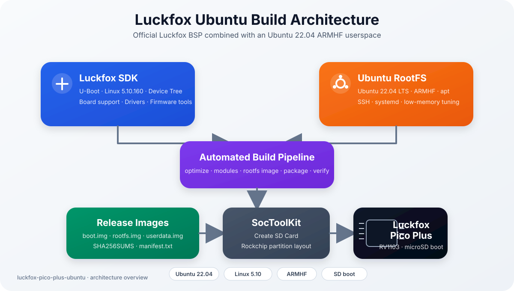

# Ubuntu 22.04 for Luckfox Pico Plus

> A reproducible Ubuntu 22.04 build environment for the Luckfox Pico Plus (RV1103), based on the official Luckfox SDK.

<p align="center">


</p>

---

## Overview

The official **Luckfox SDK** provides a Buildroot-based Linux system for the Luckfox Pico family.

While Buildroot is an excellent solution for dedicated embedded appliances, many developers prefer a full Linux distribution with a familiar userspace, package management and development tools.

This project combines the best of both worlds:

- **Official Luckfox SDK**
  - Bootloader
  - Linux kernel
  - Device Tree
  - Hardware support

- **Ubuntu 22.04 LTS**
  - ARMHF userspace
  - `apt` package manager
  - OpenSSH
  - Standard Ubuntu environment

The result is a lightweight Ubuntu-based embedded Linux system that boots directly from a microSD card on the **Luckfox Pico Plus** while remaining fully compatible with the official SDK.

---

## Why this project?

The primary goal is **not** to replace the official SDK.

Instead, this project provides a reproducible way to run Ubuntu on the Luckfox Pico Plus while continuing to use the original Rockchip kernel and board support package.

This makes it much easier to:

- develop Linux applications
- install software using `apt`
- use familiar Ubuntu tooling
- build embedded gateways
- create IoT devices
- prototype new applications

without maintaining a custom Buildroot configuration.

---

## Current Status

| Component | Status |
|-----------|--------|
| Ubuntu 22.04 | ✅ |
| Linux Kernel | ✅ |
| Ethernet | ✅ |
| SSH | ✅ |
| apt | ✅ |
| SD Card Boot | ✅ |
| Automated Build | ✅ |
| Release Pipeline | ✅ |
| GPIO Documentation | 🚧 |
| Camera Support | 🚧 |

---

## Features

- Ubuntu 22.04 LTS (Jammy Jellyfish)
- ARMHF userspace
- Linux 5.10.x kernel from the official Luckfox SDK
- Ethernet networking
- OpenSSH server
- `apt` package manager
- Automated Ubuntu root filesystem generation
- Automated firmware generation
- Automated release packaging
- Swap support for low-memory systems
- Optimized systemd configuration
- SHA-256 verification
- Fully reproducible build process

---

## Architecture

<p align="center">
  
</p>

## Quick Start

```bash
git clone https://github.com/<YOUR_USERNAME>/luckfox-pico-plus-ubuntu.git

cd luckfox-pico-plus-ubuntu

./scripts/setup-wsl.sh

./scripts/clone-sdk.sh

./scripts/build-all.sh
```

The generated firmware images will be available in:

```text
output/release/
```