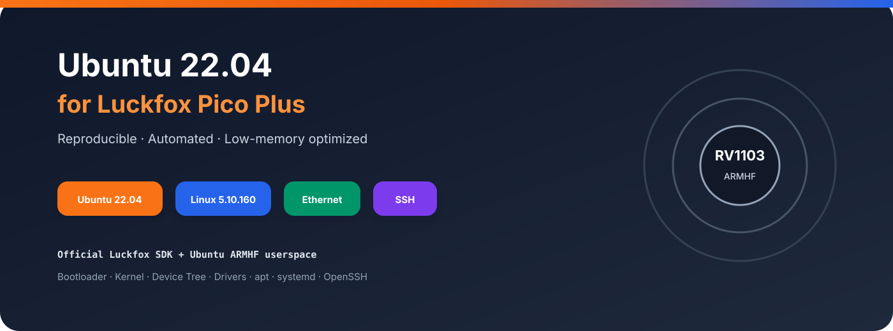
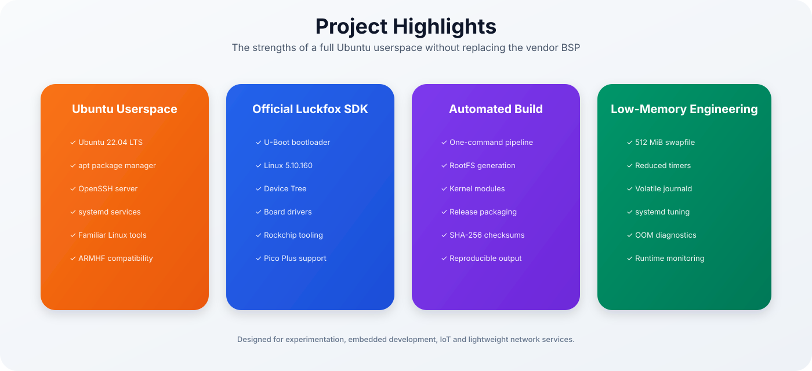
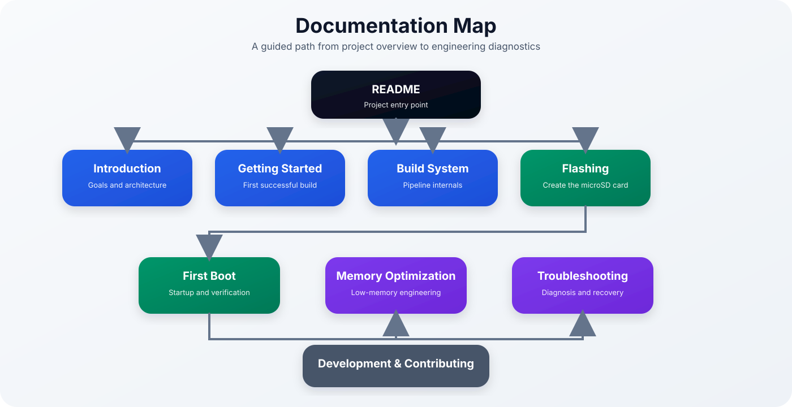
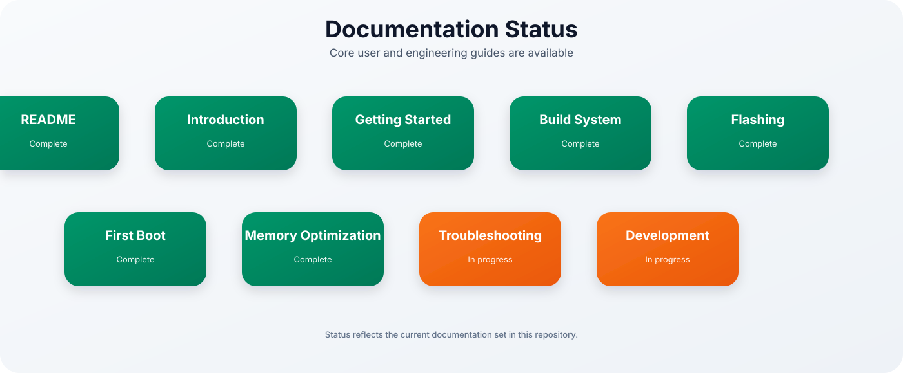
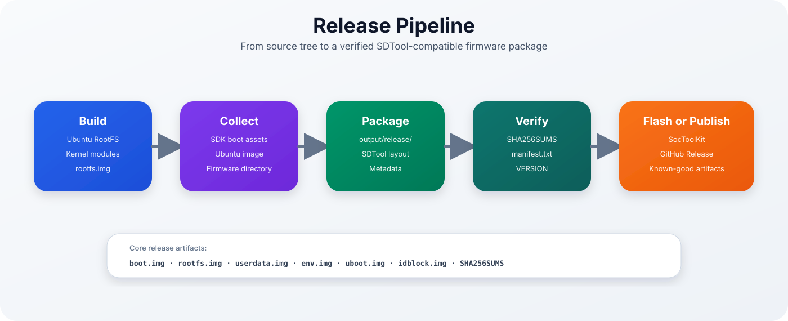
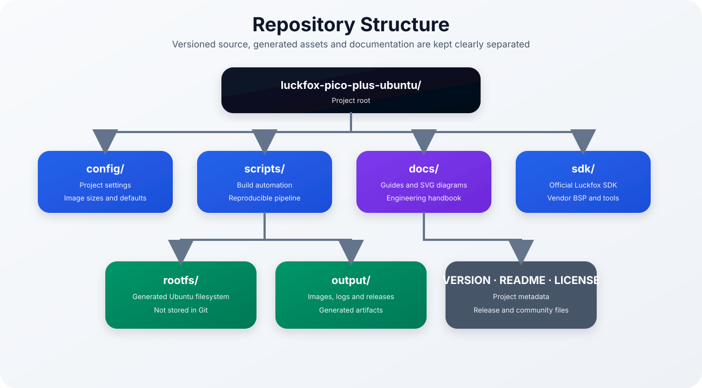
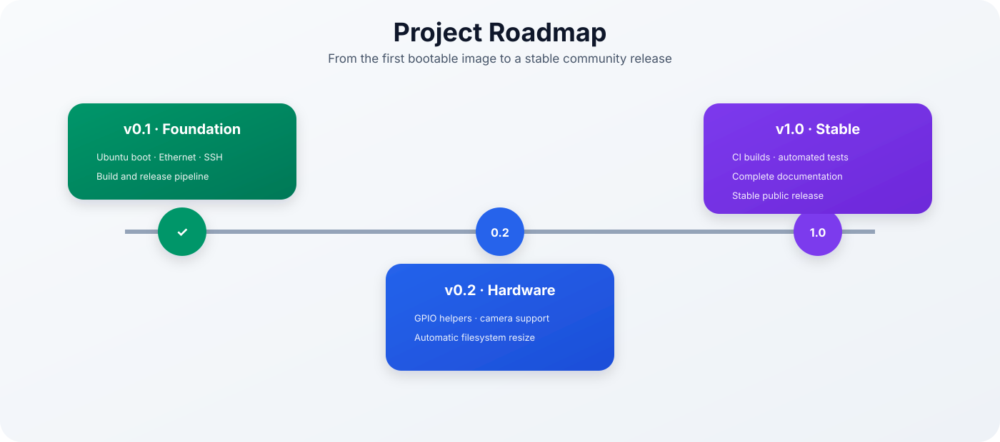

# Ubuntu 22.04 for Luckfox Pico Plus

<p align="center">
  
</p>

<p align="center">


</p>

> A reproducible Ubuntu 22.04 LTS build environment for the **Luckfox Pico Plus (RV1103)**, based on the official Luckfox SDK.

---

## Overview

The official Luckfox SDK provides a compact Buildroot-based Linux system with the bootloader, kernel, Device Tree, hardware drivers and Rockchip firmware tools required by the Luckfox Pico Plus.

This project keeps those vendor components and replaces only the default Buildroot userspace with a minimal **Ubuntu 22.04 LTS ARMHF** root filesystem.

The result combines:

- the hardware compatibility of the official Luckfox SDK,
- the familiar Ubuntu userspace,
- `apt` package management,
- OpenSSH and systemd,
- an automated and reproducible release pipeline,
- and targeted optimizations for the board's extremely limited usable memory.

> [!IMPORTANT]
> This project is experimental. Keep a serial console connected during development and retain a known-good microSD card for recovery.

---

## Project at a Glance

| Component | Value |
|-----------|-------|
| Board | Luckfox Pico Plus |
| SoC | Rockchip RV1103 |
| Userspace | Ubuntu 22.04 LTS |
| Architecture | ARMHF |
| Kernel | Linux 5.10.160 |
| Boot medium | microSD |
| Package manager | `apt` |
| Remote access | OpenSSH |
| Build host | Ubuntu 22.04, native or WSL2 |
| Release format | SocToolKit-compatible individual images |

---

## Project Highlights

<p align="center">
  
</p>

### Why combine Buildroot and Ubuntu?

Buildroot is an excellent solution for fixed-purpose embedded appliances. It produces small, deterministic images and provides precise control over every package.

Ubuntu is more convenient when the primary goal is application development, package installation and rapid experimentation.

This project deliberately uses both:

| Official Luckfox SDK | Ubuntu 22.04 userspace |
|----------------------|------------------------|
| U-Boot | `apt` package management |
| Linux kernel | OpenSSH |
| Device Tree | systemd |
| Board drivers | familiar shell and tools |
| Rockchip firmware tools | large package ecosystem |

The vendor boot chain remains unchanged, while the userspace can be maintained using normal Ubuntu workflows.

---

## Current Capabilities

- Ubuntu 22.04 LTS ARMHF userspace
- Linux 5.10.160 from the official Luckfox SDK
- microSD-card boot
- Ethernet networking
- OpenSSH server
- `apt` package management
- automated Ubuntu RootFS generation
- automatic kernel-module integration
- ext4 `rootfs.img` generation
- SocToolKit-compatible release packaging
- SHA-256 release verification
- 512 MiB swap support
- reduced systemd maintenance timers
- volatile and size-limited journald
- detailed first-boot, memory and recovery documentation

---

## Architecture

<p align="center">
  
</p>

The project separates the vendor BSP from the Ubuntu userspace. This makes SDK updates, troubleshooting and long-term maintenance easier than a heavily modified vendor tree.

---

## Documentation

<p align="center">
  
</p>

| Guide | Description |
|-------|-------------|
| [Introduction](docs/introduction.md) | Motivation, project goals and system architecture |
| [Getting Started](docs/getting-started.md) | Prepare the host and build the first image |
| [Build System](docs/build-system.md) | Complete build and release pipeline |
| [Flashing](docs/flashing.md) | Create a bootable microSD card with SocToolKit |
| [First Boot](docs/first-boot.md) | UART, SSH, swap and filesystem verification |
| [Memory Optimization](docs/memory-optimization.md) | Running Ubuntu with approximately 31 MiB visible RAM |
| [Troubleshooting](docs/troubleshooting.md) | Layered diagnosis, recovery and log collection |
| [Development](docs/development.md) | Repository internals and contribution guidance |
| [Project Roadmap](docs/project-roadmap.md) | Long-term vision, milestones and release strategy |

---

## Documentation Status

<p align="center">
  
</p>

---

## Quick Start

### 1. Clone the repository

```bash
mkdir -p ~/projects
cd ~/projects

git clone https://github.com/okoebernik/luckfox-pico-plus-ubuntu.git
cd luckfox-pico-plus-ubuntu
```

> [!TIP]
> Under WSL2, keep the project in the native Linux filesystem under `/home/...` rather than `/mnt/c/...`.

### 2. Install the build environment

```bash
./scripts/setup-wsl.sh
```

### 3. Download the official Luckfox SDK

```bash
./scripts/clone-sdk.sh
```

### 4. Build the complete release

```bash
./scripts/build-all.sh
```

### 5. Verify the generated files

```bash
cd output/release
sha256sum -c SHA256SUMS
```

The complete release is generated in:

```text
output/release/
```

Detailed instructions are available in [Getting Started](docs/getting-started.md).

---

## Build Pipeline

<p align="center">
  
</p>

The complete build is orchestrated by:

```bash
./scripts/build-all.sh
```

The pipeline:

1. optimizes the Ubuntu root filesystem,
2. installs kernel modules,
3. generates `rootfs.img`,
4. collects the SDK firmware assets,
5. creates the flashable release directory,
6. and generates integrity metadata.

---

## Release Pipeline

<p align="center">
  
</p>

A successful release typically contains:

```text
output/release/
├── .env.txt
├── boot.img
├── download.bin
├── env.img
├── idblock.img
├── manifest.txt
├── rootfs.img
├── sd_update.txt
├── SHA256SUMS
├── tftp_update.txt
├── uboot.img
├── userdata.img
└── VERSION
```

These individual images are imported into the official Luckfox SocToolKit to create the bootable microSD card.

> [!WARNING]
> Do not use the Buildroot reference `update.img` as the Ubuntu release. The Ubuntu workflow uses the individual files from `output/release/`.

---

## Repository Structure

<p align="center">
  
</p>

Generated RootFS trees and firmware images are intentionally excluded from Git. The repository stores only the scripts, configuration and documentation needed to recreate them.

---

## First Login

Connect through UART2 or SSH:

```bash
ssh pico@<board-ip>
```

Immediately verify:

```bash
cat /etc/os-release
uname -a
free -h
swapon --show
ip address
df -h
sudo systemctl --failed
```

The system should report:

- Ubuntu 22.04 LTS,
- Linux 5.10.160,
- an active DHCP address,
- approximately 512 MiB swap,
- and no unexpected failed services.

See [First Boot](docs/first-boot.md) for the complete procedure.

---

## Low-Memory Operation

The current board configuration exposes only approximately **31 MiB** of RAM to Linux. Stable Ubuntu operation therefore depends on:

- an active 512 MiB swapfile,
- disabled automatic maintenance timers,
- controlled logging,
- careful workload selection,
- and continuous observation of OOM events.

This is a development platform for lightweight embedded workloads, not a general-purpose server.

See [Memory Optimization](docs/memory-optimization.md) before installing larger services or language runtimes.

---

## Roadmap

<p align="center">
  
</p>

### v0.1 — Foundation

- bootable Ubuntu userspace
- Ethernet and SSH
- automated image generation
- release packaging
- engineering documentation

### v0.2 — Engineering Quality

- improved build validation
- better diagnostics and logging
- automatic RootFS expansion
- release consistency verification

### v1.0 — Stable Community Release

- automated CI builds
- reproducibility testing
- stable release artifacts
- complete contributor documentation

---

## Known Limitations

- Approximately 31 MiB of RAM is visible to Linux with the current board configuration.
- Swap on microSD is required and introduces storage latency and write traffic.
- Memory-intensive workloads can still trigger the OOM killer.
- Native package compilation on the board is generally impractical.
- Camera and GPIO workflows are not yet fully documented.
- The project currently targets the Luckfox Pico Plus specifically.

---

## Contributing

Contributions, bug reports and documentation improvements are welcome.

Before opening a pull request:

1. keep changes reproducible,
2. avoid committing generated firmware or RootFS files,
3. document new scripts and configuration,
4. test a complete rebuild,
5. verify the resulting release checksums,
6. include UART and diagnostic logs for hardware-related fixes.

See `CONTRIBUTING.md` when available.

---

## Reporting Problems

A useful issue should include:

- exact board model,
- project version and Git commit,
- build-host details,
- SD-card model,
- complete UART output,
- `dmesg`,
- `journalctl -b`,
- memory and swap state,
- exact reproduction steps.

The [Troubleshooting Guide](docs/troubleshooting.md) contains a diagnostic-bundle workflow and issue template.

---

## License

This project is released under the MIT License.

See `LICENSE` for details.

---

## Acknowledgements

This project depends on and benefits from:

- the official Luckfox SDK,
- the Rockchip boot and firmware tools,
- Ubuntu and Debian ARMHF infrastructure,
- Buildroot,
- QEMU user-mode emulation,
- and the wider embedded-Linux community.

---

<p align="center">

**Ubuntu 22.04 for Luckfox Pico Plus**

Official Luckfox BSP · Ubuntu ARMHF userspace · Reproducible releases

</p>
