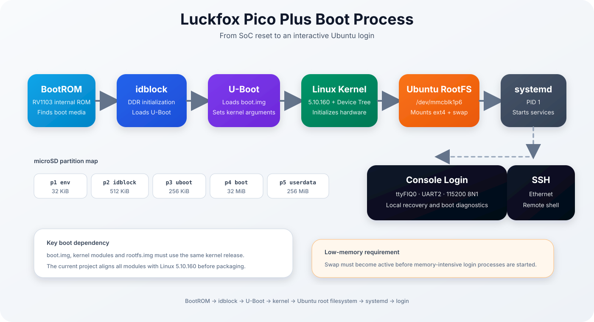
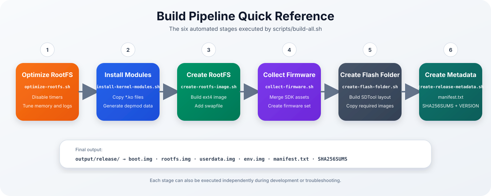
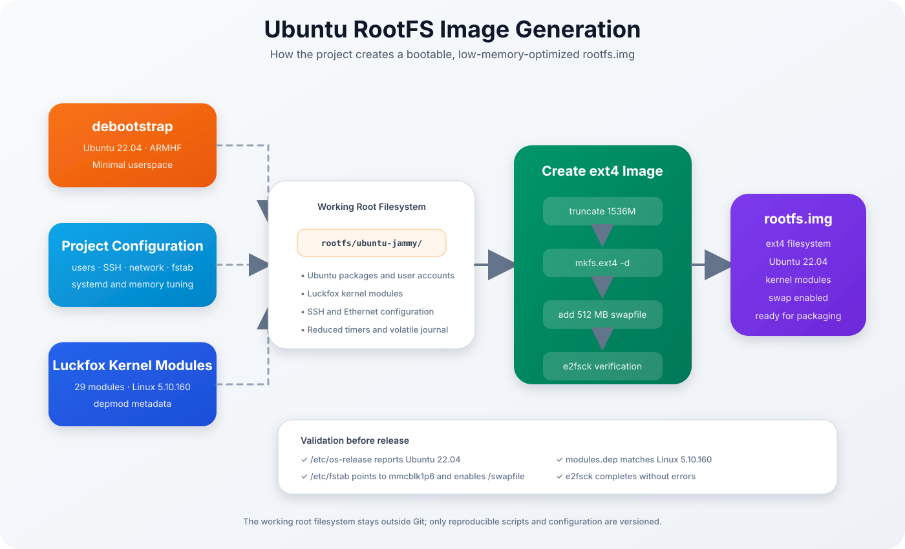
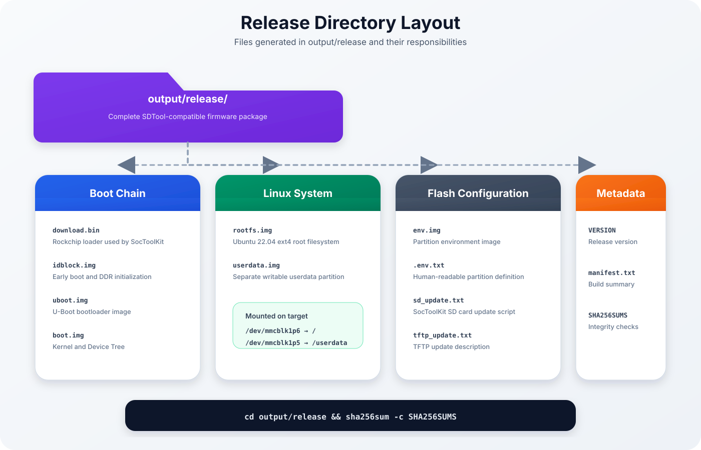

<p align="center">

# Ubuntu 22.04 for Luckfox Pico Plus

### Build System Documentation


</p>

---

> This document describes the complete build pipeline used to generate a bootable Ubuntu 22.04 firmware image for the Luckfox Pico Plus.

---

| Previous | Home | Next |
|-----------|------|------|
| [← Getting Started](getting-started.md) | [README](../README.md) | [Flashing →](flashing.md) |

---

# Table of Contents

- Design Goals
- Overall Architecture
- Build Pipeline
- Boot Process
- Ubuntu RootFS Generation
- Firmware Collection
- Release Layout
- Build Artifacts
- Release Verification

---

# Design Goals

The build system follows four fundamental principles.

## Reproducible

Every firmware image should be reproducible from source.

No manual modifications are required after cloning the repository.

---

## Compatible

The official Luckfox SDK remains responsible for:

- U-Boot
- Linux Kernel
- Device Tree
- Hardware Drivers

The Ubuntu userspace is added without modifying vendor components.

---

## Automated

Running

```bash
./scripts/build-all.sh
```

creates a complete firmware release.

---

## Maintainable

Each build stage is implemented as an independent script.

This allows individual stages to be executed during development or debugging.

---

# Overall Architecture

The complete firmware generation process is shown below.

<p align="center">


</p>

The build starts with two independent sources:

- the official Luckfox SDK
- the Ubuntu root filesystem

Both are merged only during the final image creation process.

---

# Boot Process

The following diagram illustrates the complete boot sequence.

<p align="center">



</p>

Boot sequence:

1. BootROM
2. idblock
3. U-Boot
4. Linux Kernel
5. Ubuntu RootFS
6. systemd
7. Login (UART / SSH)

This project intentionally keeps the vendor boot chain unchanged.

Only the userspace is replaced.

---

## Build Pipeline

<p align="center">
  
</p>

The complete build is orchestrated by:

```bash
./scripts/build-all.sh

---

# Step 1 – Optimize RootFS

Script

```text
scripts/optimize-rootfs.sh
```

Purpose

- disable unnecessary timers
- reduce systemd memory usage
- enable swap support
- reduce logging
- optimize for low-memory operation

---

# Step 2 – Install Kernel Modules

Script

```text
scripts/install-kernel-modules.sh
```

Purpose

- detect kernel version
- copy kernel modules
- execute depmod
- generate module metadata

Result

```
lib/modules/

└── 5.10.160/

    modules.dep

    modules.alias

    extra/

        *.ko
```

---

# Step 3 – RootFS Image Generation

The Ubuntu image generation process is illustrated below.

<p align="center">



</p>

During this step:

- Ubuntu is copied
- kernel modules are installed
- swap is created
- ext4 image is generated
- filesystem is verified

Output

```
rootfs.img
```

---

# Step 4 – Collect Firmware

Script

```
scripts/collect-firmware.sh
```

Generated images:

```
boot.img

download.bin

env.img

idblock.img

rootfs.img

uboot.img

userdata.img
```

Output:

```
output/firmware/
```

---

# Step 5 – Flash Folder

Script

```
scripts/create-flash-folder.sh
```

Creates

```
output/release/
```

ready for SocToolKit.

---

# Release Layout

The generated release directory looks as follows.

<p align="center">



</p>

| File | Description |
|------|-------------|
| download.bin | Rockchip loader |
| idblock.img | DDR initialization |
| uboot.img | U-Boot |
| boot.img | Linux kernel |
| rootfs.img | Ubuntu system |
| userdata.img | Writable partition |
| env.img | Environment |
| manifest.txt | Release metadata |
| SHA256SUMS | Integrity verification |

---

# Build Artifacts

The build produces three logical outputs.

## Firmware

```
output/firmware/
```

## Release

```
output/release/
```

## Logs

```
output/build-release.log

output/build-rootfs.log

output/build-all-sdk.log
```

These logs are extremely useful when debugging build failures.

---

# Release Verification

Before flashing, verify every generated image.

```bash
cd output/release

sha256sum -c SHA256SUMS
```

Expected output:

```
boot.img: OK

rootfs.img: OK

userdata.img: OK

...
```

---

# Why This Architecture?

The project deliberately separates the vendor SDK from the Ubuntu userspace.

Advantages include:

- minimal vendor modifications
- easy SDK upgrades
- reproducible builds
- cleaner Git history
- simpler debugging
- long-term maintainability

---

# Related Documentation

| Document | Description |
|-----------|-------------|
| introduction.md | Project overview |
| getting-started.md | Initial setup |
| flashing.md | SD card creation |
| first-boot.md | First startup |
| memory-optimization.md | Low-memory tuning |
| troubleshooting.md | Known issues |

---

---

| Previous | Home | Next |
|-----------|------|------|
| [← Getting Started](getting-started.md) | [README](../README.md) | [Flashing →](flashing.md) |

<div align="center">

**Ubuntu 22.04 for Luckfox Pico Plus**

Build System Documentation

Version 0.1.0

</div>