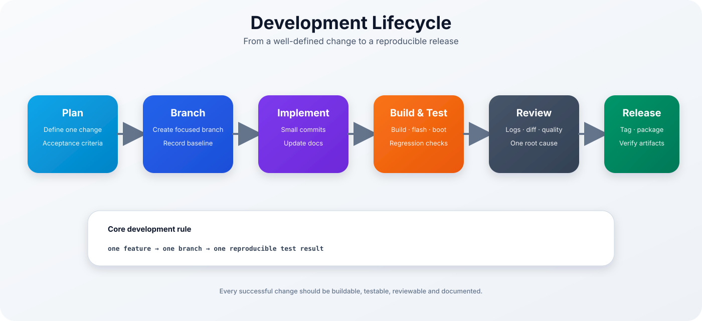
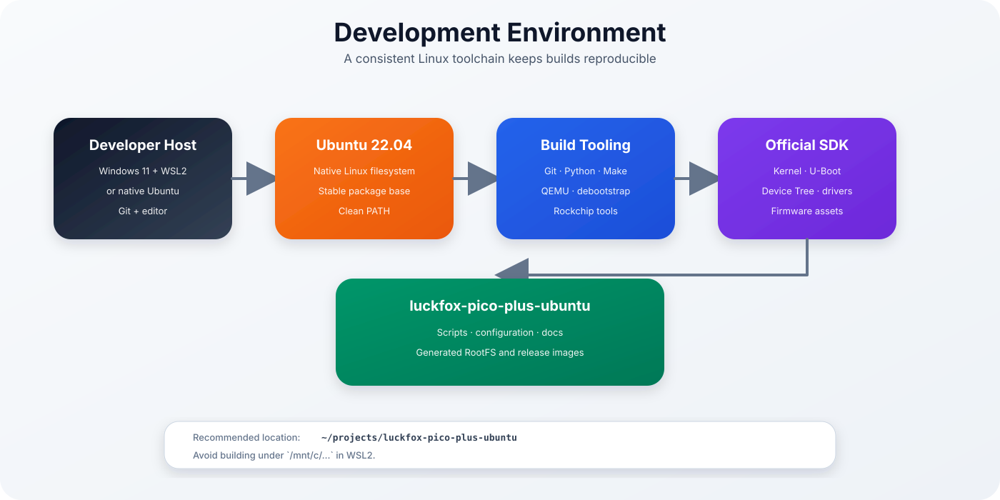
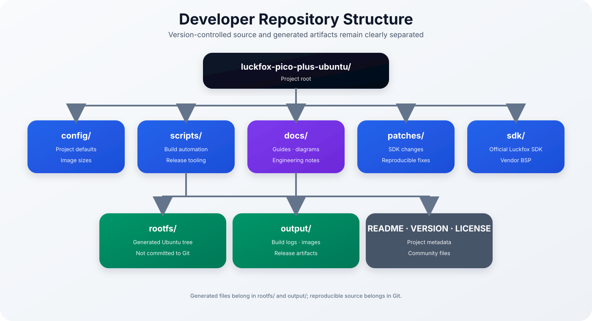
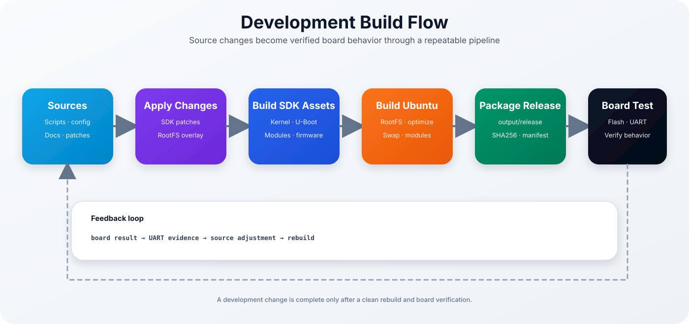
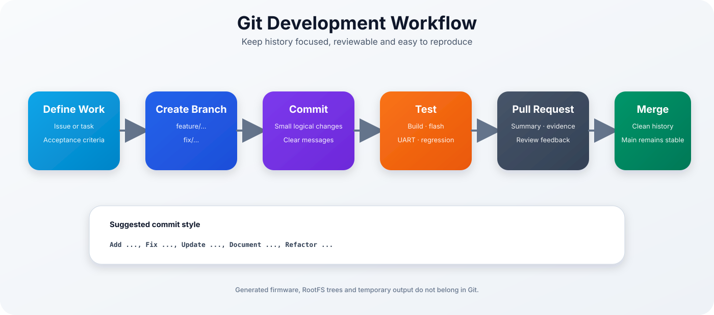
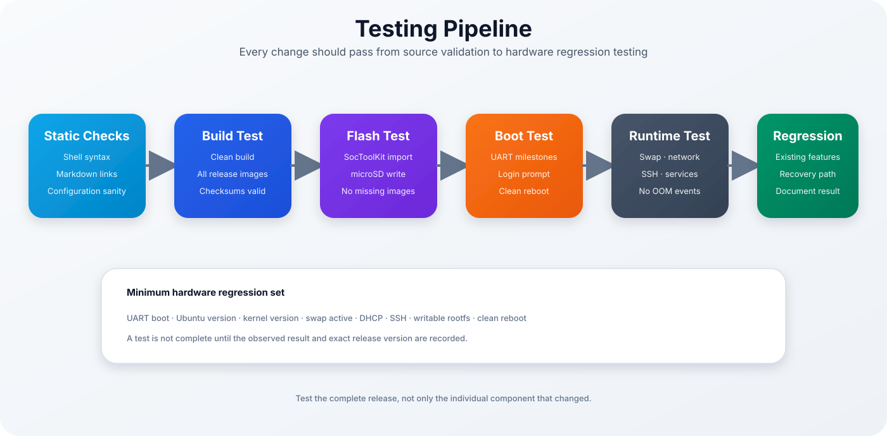
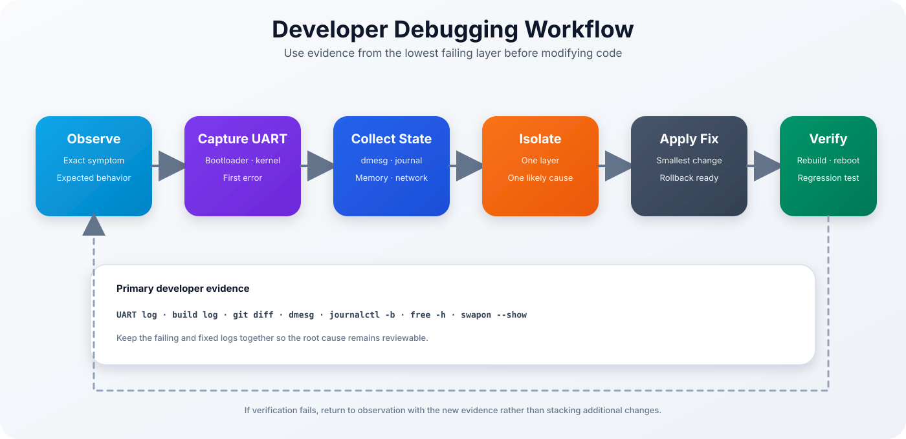
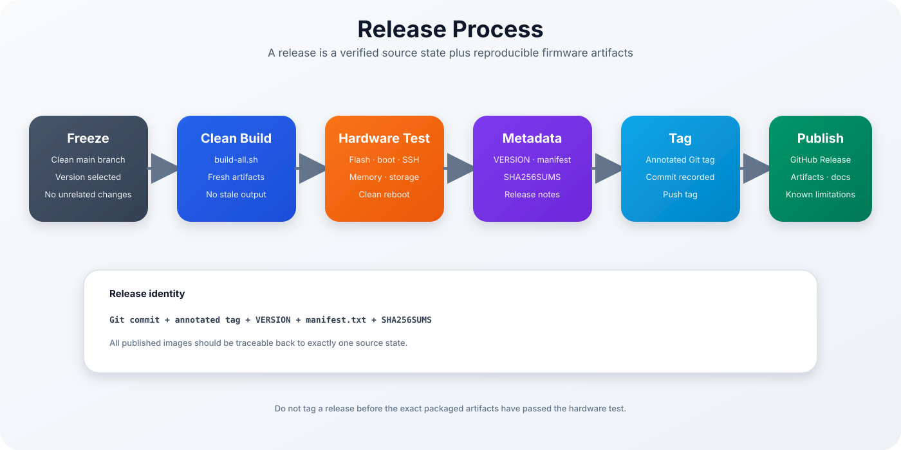
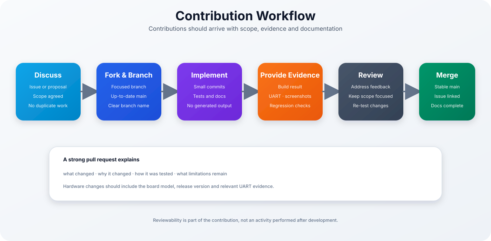
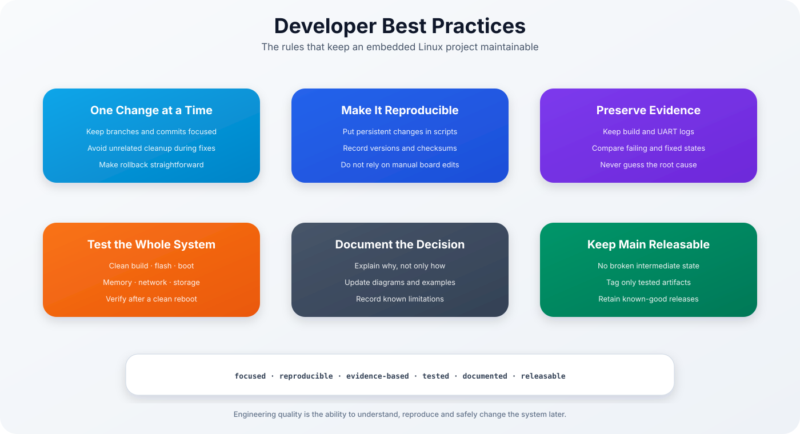

<p align="center">

# Ubuntu 22.04 for Luckfox Pico Plus

### Development Guide



</p>

> [!NOTE]
> This guide describes how to develop the project safely and reproducibly. It covers the development environment, repository structure, build flow, Git workflow, testing, debugging, releases and contributions.

| Previous | Home | Next |
|-----------|------|------|
| [← Troubleshooting](troubleshooting.md) | [README](../README.md) | [Project Roadmap →](project-roadmap.md) |

---

## Table of Contents

- [Development Philosophy](#development-philosophy)
- [Development Environment](#development-environment)
- [Repository Structure](#repository-structure)
- [Development Build Flow](#development-build-flow)
- [Git Workflow](#git-workflow)
- [Coding Guidelines](#coding-guidelines)
- [Testing Pipeline](#testing-pipeline)
- [Debugging Workflow](#debugging-workflow)
- [Release Process](#release-process)
- [Contribution Workflow](#contribution-workflow)
- [Developer Best Practices](#developer-best-practices)
- [Useful Commands](#useful-commands)
- [Development Checklist](#development-checklist)

---

## Development Philosophy

The project follows five principles:

1. **Reproducibility** — every persistent change belongs in scripts, configuration or patches.
2. **Observability** — UART, build logs and system diagnostics must make failures understandable.
3. **Small changes** — one branch and one logical change at a time.
4. **Hardware verification** — a successful build is not complete until the image boots on the board.
5. **Documentation** — design decisions, limitations and recovery steps must remain understandable later.

> [!IMPORTANT]
> Manual changes made only on a running board are experiments, not finished project changes. Convert successful experiments into reproducible source changes.

The preferred lifecycle is:

```text
Plan
  ↓
Create branch
  ↓
Implement
  ↓
Build and flash
  ↓
Test on hardware
  ↓
Review evidence
  ↓
Commit and publish
```

---

## Development Environment

<p align="center">
  
</p>

### Supported Host

Recommended:

```text
Ubuntu 22.04 LTS
```

This can be:

- native Ubuntu,
- Ubuntu 22.04 under WSL2,
- a dedicated Linux virtual machine.

Under WSL2, keep the repository inside the Linux filesystem:

```text
~/projects/luckfox-pico-plus-ubuntu
```

Avoid:

```text
/mnt/c/...
```

The Windows-mounted filesystem can cause slower builds, permission differences and unexpected path behavior.

### Host Verification

```bash
cat /etc/os-release
uname -a
date
timedatectl status
df -h .
printf '%s\n' "$PATH"
```

### Clean Linux PATH

If Windows applications appear in the WSL build path:

```bash
export PATH=/usr/local/sbin:/usr/local/bin:/usr/sbin:/usr/bin:/sbin:/bin
```

### Time Problems in WSL

If timestamps are incorrect:

```powershell
wsl --shutdown
```

Then restart the Ubuntu distribution.

### Required Tools

Typical tools include:

- Git
- Python 3
- GNU Make
- Bash
- `debootstrap`
- QEMU user-mode emulation
- ext4 filesystem tools
- compression and archive utilities
- Rockchip and Luckfox SDK tools

The project setup script installs the required host packages:

```bash
./scripts/setup-wsl.sh
```

---

## Repository Structure

<p align="center">
  
</p>

Typical structure:

```text
luckfox-pico-plus-ubuntu/
├── config/
│   └── project.env
├── docs/
│   └── images/
├── patches/
├── scripts/
├── sdk/
├── rootfs/
├── output/
├── VERSION
├── README.md
└── LICENSE
```

### `config/`

Contains project-wide settings such as:

- root filesystem image size,
- userdata image size,
- board selection,
- source and output paths,
- release metadata.

Example:

```bash
grep -n 'ROOTFS_IMAGE_SIZE' config/project.env
```

Avoid defining the same setting more than once.

### `scripts/`

Contains reproducible automation.

Examples:

```text
setup-wsl.sh
clone-sdk.sh
optimize-rootfs.sh
install-kernel-modules.sh
create-rootfs-image.sh
collect-firmware.sh
create-flash-folder.sh
create-release-metadata.sh
build-all.sh
```

Each script should:

- use `set -euo pipefail`,
- resolve the project root safely,
- validate required files,
- fail with clear messages,
- avoid silent partial output.

### `docs/`

Contains Markdown guides and SVG diagrams.

Documentation should be updated in the same branch as the related code change.

### `patches/`

Contains reproducible changes to the vendor SDK.

Prefer patch files over undocumented edits inside `sdk/`.

### `sdk/`

Contains the official Luckfox SDK checkout.

The SDK is usually not committed directly to this project repository.

### `rootfs/`

Contains the generated Ubuntu filesystem tree.

This directory is generated and should not be committed.

### `output/`

Contains build logs, intermediate files, firmware images and release artifacts.

Generated contents should remain excluded through `.gitignore`.

---

## Development Build Flow

<p align="center">
  
</p>

A source change flows through several stages:

```text
Project source
  ↓
SDK patches and RootFS changes
  ↓
Kernel, U-Boot and firmware assets
  ↓
Ubuntu RootFS
  ↓
Release packaging
  ↓
microSD flash
  ↓
Board verification
```

### Complete Build

```bash
./scripts/build-all.sh
```

### Build Logging

```bash
set -o pipefail
./scripts/build-all.sh 2>&1 | tee output/build.log
```

### Independent Stages

During development, stages can be executed separately:

```bash
sudo ./scripts/optimize-rootfs.sh
sudo ./scripts/install-kernel-modules.sh
sudo ./scripts/create-rootfs-image.sh
./scripts/collect-firmware.sh
./scripts/create-flash-folder.sh
./scripts/create-release-metadata.sh
```

> [!WARNING]
> Running an individual stage can leave output from an earlier build in place. Before release testing, always run a complete clean pipeline.

### Release Verification

```bash
cd output/release
sha256sum -c SHA256SUMS
```

Expected result:

```text
OK
```

for every listed artifact.

---

## Git Workflow

<p align="center">
  
</p>

### Start from an Updated Main Branch

```bash
git switch main
git pull --ff-only
```

### Create a Focused Branch

Feature:

```bash
git switch -c feature/<short-description>
```

Bug fix:

```bash
git switch -c fix/<short-description>
```

Documentation:

```bash
git switch -c docs/<short-description>
```

### Review Changes

```bash
git status
git diff
git diff --staged
```

### Stage Explicitly

```bash
git add scripts/example.sh
git add docs/development.md
git add docs/images/example.svg
```

Avoid staging generated trees:

```text
rootfs/
output/
sdk/
```

### Commit Messages

Use an imperative description:

```text
Add automated release metadata generation
Fix RootFS image size validation
Update first-boot memory checks
Document the development workflow
```

Example:

```bash
git commit -m "Add automated release metadata generation"
```

### Push the Branch

```bash
git push -u origin feature/<short-description>
```

### Annotated Tags

For a tested release:

```bash
git tag -a v0.2.0 -m "Luckfox Pico Plus Ubuntu v0.2.0"
git push origin v0.2.0
```

---

## Coding Guidelines

### Shell Scripts

Start with:

```bash
#!/usr/bin/env bash
set -euo pipefail
```

Resolve the project root:

```bash
PROJECT_DIR="$(cd "$(dirname "${BASH_SOURCE[0]}")/.." && pwd)"
```

Quote variable expansions:

```bash
cp "${SOURCE_FILE}" "${TARGET_DIR}/"
```

Validate required input:

```bash
if [[ ! -f "${SOURCE_FILE}" ]]; then
    echo "Required file missing: ${SOURCE_FILE}" >&2
    exit 1
fi
```

Use clear stage output:

```bash
echo "=== Creating Ubuntu RootFS image ==="
```

### Python

Python utilities should:

- support Python 3,
- use `pathlib`,
- validate arguments,
- provide useful error messages,
- avoid hidden global state.

### Markdown

Use:

- one `#` heading for the document title,
- `##` for primary chapters,
- fenced code blocks with a language,
- relative links,
- meaningful image alternative text,
- callouts for warnings and engineering notes.

Example:

```markdown
> [!WARNING]
> Do not run filesystem repair against a mounted root filesystem.
```

### SVGs

SVG files should:

- use a meaningful `<title>` and `<desc>`,
- include a stable `viewBox`,
- use the shared documentation design,
- remain readable on GitHub,
- avoid external font or image dependencies.

### Configuration Files

Keep one authoritative definition per setting.

Incorrect:

```bash
ROOTFS_IMAGE_SIZE="4G"
ROOTFS_IMAGE_SIZE="1536M"
```

Correct:

```bash
ROOTFS_IMAGE_SIZE="1536M"
```

---

## Testing Pipeline

<p align="center">
  
</p>

Testing is performed in layers.

### 1. Static Checks

Run the complete repository check:

```bash
./scripts/check-repository.sh
```

It verifies shell syntax and executable permissions, local Markdown and image
links, closed Markdown code fences and valid SVG XML. The same command runs
automatically for pull requests and pushes to `develop` or `main`.

### 2. Clean Build

```bash
rm -rf output/firmware output/release
./scripts/build-all.sh
```

Do not delete the source RootFS or SDK unless a full regeneration is intended.

### 3. Release Integrity

```bash
cd output/release
sha256sum -c SHA256SUMS
```

### 4. Flash Test

Verify that SocToolKit accepts the complete release folder and writes the microSD card successfully.

### 5. Boot Test

Use UART and confirm:

```text
U-Boot
Starting kernel ...
Ubuntu 22.04 LTS
login prompt
```

### 6. Runtime Test

```bash
cat /etc/os-release
uname -a
free -h
swapon --show
ip address
df -h
sudo systemctl --failed
```

### 7. Regression Test

Verify that existing functionality remains operational:

- UART boot,
- Ethernet,
- SSH,
- swap,
- writable RootFS,
- clean reboot,
- no new OOM events.

---

## Debugging Workflow

<p align="center">
  
</p>

The debugging process should begin with evidence.

### Capture Build Evidence

```bash
./scripts/build-all.sh 2>&1 | tee output/build-debug.log
```

### Capture Board Evidence

Keep the complete UART session.

On the board:

```bash
dmesg
sudo journalctl -b --no-pager
free -h
swapon --show
ip address
lsblk -f
```

### Isolate the Layer

Typical layers:

```text
Host environment
Repository
SDK
Bootloader
Kernel
RootFS
systemd
Network
SSH
Application
```

### Apply the Smallest Fix

Do not combine:

- configuration cleanup,
- SDK update,
- kernel change,
- RootFS package change,

in one debugging step.

### Compare Before and After

Keep:

- failing log,
- Git diff,
- fixed log,
- exact release version.

---

## Release Process

<p align="center">
  
</p>

A release is more than a tag. It is a verified relationship between source and artifacts.

### 1. Prepare the Version

Update:

```text
VERSION
```

Example:

```text
0.2.0
```

### 2. Confirm Repository State

```bash
git status
git log --oneline --decorate -5
```

The release branch should contain no unintended changes.

### 3. Run a Clean Build

```bash
rm -rf output/firmware output/release
./scripts/build-all.sh
```

### 4. Test the Exact Artifacts

Flash the generated files from:

```text
output/release/
```

Do not rebuild after the final successful hardware test unless the new artifacts are tested again.

### 5. Verify Metadata

```bash
cat output/release/VERSION
cat output/release/manifest.txt
sha256sum -c output/release/SHA256SUMS
```

### 6. Commit and Tag

```bash
git add VERSION scripts config docs README.md
git commit -m "Prepare v0.2.0 release"
git tag -a v0.2.0 -m "Luckfox Pico Plus Ubuntu v0.2.0"
git push origin main
git push origin v0.2.0
```

### 7. Publish

A release should include:

- release notes,
- supported board,
- known limitations,
- verified firmware package,
- checksums,
- links to flashing and first-boot documentation.

---

## Contribution Workflow

<p align="center">
  
</p>

### Before Starting

Search existing issues and pull requests.

For larger changes, discuss:

- intended feature,
- affected board components,
- proposed implementation,
- test method,
- documentation impact.

### Pull Request Requirements

A strong pull request explains:

- what changed,
- why it changed,
- how it was tested,
- which release or board was used,
- what limitations remain.

Hardware-related changes should include:

- board model,
- project commit,
- UART evidence,
- relevant diagnostic output,
- regression results.

### Generated Files

Do not include:

```text
rootfs/
output/
sdk/
*.img
large build logs
```

unless a maintainer explicitly requests an artifact for diagnosis.

---

## Developer Best Practices

<p align="center">
  
</p>

### Keep Changes Focused

A branch should answer one question.

### Make Changes Reproducible

Persistent changes belong in:

- scripts,
- configuration,
- patches,
- RootFS overlays,
- documentation.

### Preserve Evidence

Retain:

- build logs,
- UART logs,
- checksums,
- Git commit,
- board and SD-card details.

### Test the Whole System

A small change can affect:

- image layout,
- boot order,
- memory pressure,
- service startup,
- network availability.

### Document Decisions

Explain why a setting or workaround exists.

### Keep Main Releasable

The main branch should not contain:

- half-completed migrations,
- broken build stages,
- untested release metadata,
- undocumented manual requirements.

---

## Useful Commands

### Repository

```bash
git status
git diff
git log --oneline --decorate -10
git branch --show-current
```

### Build

```bash
./scripts/build-all.sh
./scripts/build-all.sh 2>&1 | tee output/build.log
```

### Script Validation

```bash
bash -n scripts/*.sh
find scripts -maxdepth 1 -type f -name '*.sh' -printf '%M %p\n'
```

### Release Verification

```bash
find output/release -maxdepth 1 -type f -printf '%f\n' | sort
sha256sum -c output/release/SHA256SUMS
```

### Board Verification

```bash
cat /etc/os-release
uname -a
free -h
swapon --show
ip address
ip route
df -h
sudo systemctl --failed
```

### Kernel and Service Logs

```bash
dmesg | tail -n 150
sudo journalctl -b --no-pager
sudo journalctl -u ssh -b --no-pager
```

---

## Development Checklist

### Before Development

- [ ] Main branch updated
- [ ] Focused branch created
- [ ] Baseline build or board state recorded
- [ ] Acceptance criteria defined
- [ ] Rollback path understood

### Before Commit

- [ ] Scripts pass syntax checks
- [ ] Generated files are not staged
- [ ] Documentation updated
- [ ] Git diff reviewed
- [ ] Commit message describes one logical change

### Before Pull Request

- [ ] Complete build succeeds
- [ ] Release checksums pass
- [ ] Hardware test completed
- [ ] UART evidence retained
- [ ] Regression checks completed
- [ ] Known limitations documented

### Before Release

- [ ] Repository state clean
- [ ] Version updated
- [ ] Clean build completed
- [ ] Exact release artifacts tested
- [ ] Manifest and checksums verified
- [ ] Annotated tag created
- [ ] Release notes prepared

---

## Engineering Rules

1. One feature, one branch, one reviewable result.
2. Reproduce persistent changes through source control.
3. Investigate the first error, not the final cascade.
4. Keep UART connected during hardware development.
5. Test exact release artifacts before tagging.
6. Preserve failing and successful evidence.
7. Never commit generated RootFS or release output.
8. Update documentation with the implementation.
9. Verify every fix after a clean reboot.
10. Keep the main branch releasable.

---

## Continue Reading

| Previous | Home | Next |
|-----------|------|------|
| [← Troubleshooting](troubleshooting.md) | [README](../README.md) | [Project Roadmap →](project-roadmap.md) |
