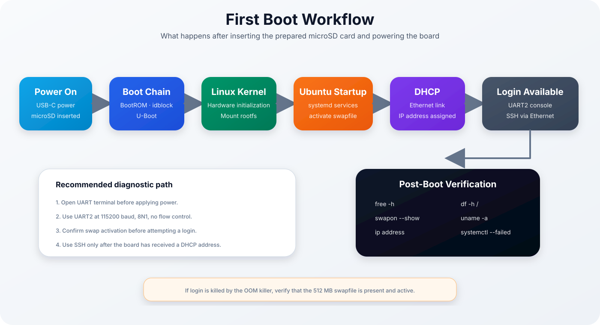
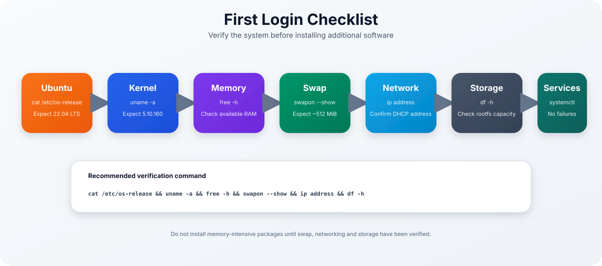
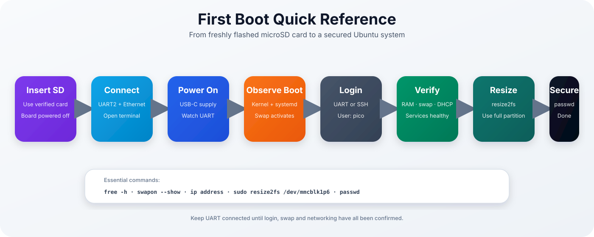

<p align="center">

# Ubuntu 22.04 for Luckfox Pico Plus

### First Boot Guide



</p>

> [!NOTE]
> This guide covers the first startup after flashing, including UART diagnostics, SSH access, swap verification, filesystem expansion and initial system hardening.

| Previous | Home | Next |
|-----------|------|------|
| [← Flashing](flashing.md) | [README](../README.md) | [Memory Optimization →](memory-optimization.md) |

---

## Table of Contents

- [Before Powering On](#before-powering-on)
- [Connect the Serial Console](#connect-the-serial-console)
- [Expected Boot Sequence](#expected-boot-sequence)
- [First Login](#first-login)
- [Verify the Installation](#verify-the-installation)
- [Check Memory and Swap](#check-memory-and-swap)
- [Verify Networking and SSH](#verify-networking-and-ssh)
- [Expand the Root Filesystem](#expand-the-root-filesystem)
- [Change Passwords](#change-passwords)
- [Check Services and Timers](#check-services-and-timers)
- [Common First-Boot Problems](#common-first-boot-problems)
- [First-Boot Checklist](#first-boot-checklist)
- [Quick Reference](#quick-reference)

---

## Before Powering On

Confirm that:

- the verified microSD card is inserted
- Ethernet is connected
- the USB-to-TTL adapter is connected to UART2
- the serial terminal is already open
- the board is not powered from the TTL adapter

> [!WARNING]
> Use a 3.3 V TTL adapter. Do not connect the adapter's 5 V or 3.3 V power pin to the board.

Recommended wiring:

| USB-to-TTL adapter | Luckfox Pico Plus |
|--------------------|-------------------|
| `GND` | `GND` |
| `RXD` | `UART2_TX` |
| `TXD` | `UART2_RX` |

TX and RX must be crossed.

---

## Connect the Serial Console

Use the following terminal settings:

```text
Baud rate: 115200
Data bits: 8
Parity: None
Stop bits: 1
Flow control: None
```

Open the terminal before applying USB-C power. This ensures that the complete BootROM, U-Boot and kernel output is captured.

---

## Expected Boot Sequence

A normal boot progresses through these stages:

1. Rockchip BootROM
2. `idblock`
3. U-Boot
4. Linux kernel 5.10.160
5. Ubuntu root filesystem
6. systemd
7. network configuration
8. serial and SSH login

Typical UART milestones include:

```text
U-Boot 2017...
Starting kernel ...
Ubuntu 22.04 LTS luckfox ttyFIQ0
luckfox login:
```

> [!IMPORTANT]
> The first boot may take longer than subsequent boots. Do not remove power while the filesystem is being checked or services are starting.

---

## First Login

Log in through the serial console:

```text
luckfox login: pico
Password:
```

Or connect through SSH after the board has obtained an IP address:

```bash
ssh pico@<board-ip>
```

The IP address can usually be found in the DHCP lease table of the router or firewall.

> [!TIP]
> Keep the serial console connected during the first SSH login. Server-side authentication and OOM errors are visible immediately on UART.

---

## Verify the Installation

<p align="center">



</p>

Run the following commands:

```bash
cat /etc/os-release
uname -a
free -h
swapon --show
ip address
df -h
sudo systemctl --failed
```

Expected values:

| Check | Expected result |
|-------|-----------------|
| Operating system | Ubuntu 22.04 LTS |
| Kernel | Linux 5.10.160 |
| Root filesystem | `/dev/mmcblk1p6` |
| Userdata | `/dev/mmcblk1p5` |
| Swap | approximately 512 MiB |
| Network | DHCP address assigned |
| SSH | port 22 reachable |

---

## Check Memory and Swap

The Luckfox Pico Plus exposes only a very small amount of usable RAM. Swap is required for reliable logins and package management.

```bash
free -h
swapon --show
```

A working system should show approximately:

```text
Mem:   31Mi
Swap:  511Mi
```

The exact used and available values vary.

> [!WARNING]
> If `login`, `sshd` or another process is terminated by the OOM killer, do not repeatedly retry the login. Verify that `/swapfile` exists and is active.

Check the swap entry:

```bash
grep '^/swapfile ' /etc/fstab
ls -lh /swapfile
```

Activate it manually if necessary:

```bash
sudo swapon /swapfile
swapon --show
```

---

## Verify Networking and SSH

Display all interfaces:

```bash
ip address
ip route
```

Check the default route:

```bash
ip route | grep '^default'
```

From another computer, verify reachability:

```bash
ping <board-ip>
ssh pico@<board-ip>
```

If SSH is not reachable, inspect the service locally:

```bash
sudo systemctl status ssh --no-pager
sudo journalctl -u ssh -b --no-pager
```

> [!TIP]
> A successful TCP connection to port 22 confirms that the kernel, Ethernet driver, IP configuration and SSH daemon are already running.

---

## Expand the Root Filesystem

The generated root filesystem image is smaller than the final SD-card partition. Expand ext4 to use the full rootfs partition:

```bash
sudo resize2fs /dev/mmcblk1p6
df -h /
```

> [!IMPORTANT]
> Confirm the root device with `mount | grep ' on / '` before running `resize2fs`. The current project uses `/dev/mmcblk1p6`.

Check the complete storage layout:

```bash
lsblk
df -h
```

---

## Change Passwords

Change the `pico` user's password:

```bash
passwd
```

Optionally set or change the root password:

```bash
sudo passwd root
```

Use strong, unique passwords.

For SSH key authentication, copy a public key to the board:

```bash
ssh-copy-id pico@<board-ip>
```

After verifying key-based login, password authentication can be disabled later.

---

## Check Services and Timers

Check for failed units:

```bash
sudo systemctl --failed
```

List enabled units:

```bash
sudo systemctl list-unit-files --state=enabled
```

List timers:

```bash
sudo systemctl list-timers --all
```

The low-memory image disables unnecessary automatic maintenance timers. Entries with `NEXT` shown as `n/a` are disabled or inactive.

> [!NOTE]
> On this board, `systemctl daemon-reload` may refuse to run when `/run/systemd` has less than systemd's safety reserve. Unit symlink changes are still persistent and become effective after reboot.

---

## Common First-Boot Problems

| Symptom | Likely cause | Recommended action |
|---------|--------------|--------------------|
| No UART output | Wrong UART or terminal settings | Use UART2, 115200 8N1, no flow control |
| Boot stops before kernel | Incomplete boot images | Reflash the complete release directory |
| Kernel panic mounting root | Wrong or damaged `rootfs.img` | Verify SHA256 and reflash |
| Login process is killed | Swap inactive, OOM condition | Activate `/swapfile` |
| SSH asks for a password, then closes | Login killed or PAM problem | Check UART and kernel log |
| SSH permission denied | Incorrect password or account state | Test local UART login |
| No DHCP address | Cable, switch or network config issue | Check link and `ip address` |
| `/` remains small | ext4 not expanded | Run `resize2fs /dev/mmcblk1p6` |
| `/run/systemd` reload warning | Very small `/run` tmpfs | Reboot after persistent unit changes |

Inspect recent kernel messages:

```bash
dmesg | tail -n 100
dmesg | grep -i -E 'oom|out of memory|killed process|error|fail'
```

---

## First-Boot Checklist

- [ ] Complete boot output visible on UART
- [ ] Ubuntu 22.04 confirmed
- [ ] Linux 5.10.160 confirmed
- [ ] Swap active
- [ ] Ethernet received a DHCP address
- [ ] SSH login successful
- [ ] Root filesystem expanded
- [ ] User password changed
- [ ] No unexpected failed services
- [ ] System reboot tested

Test a clean reboot:

```bash
sudo reboot
```

After the board returns, verify again:

```bash
uptime
free -h
swapon --show
ip address
```

---

## Quick Reference

<p align="center">



</p>

---

## Continue Reading

| Previous | Home | Next |
|-----------|------|------|
| [← Flashing](flashing.md) | [README](../README.md) | [Memory Optimization →](memory-optimization.md) |
