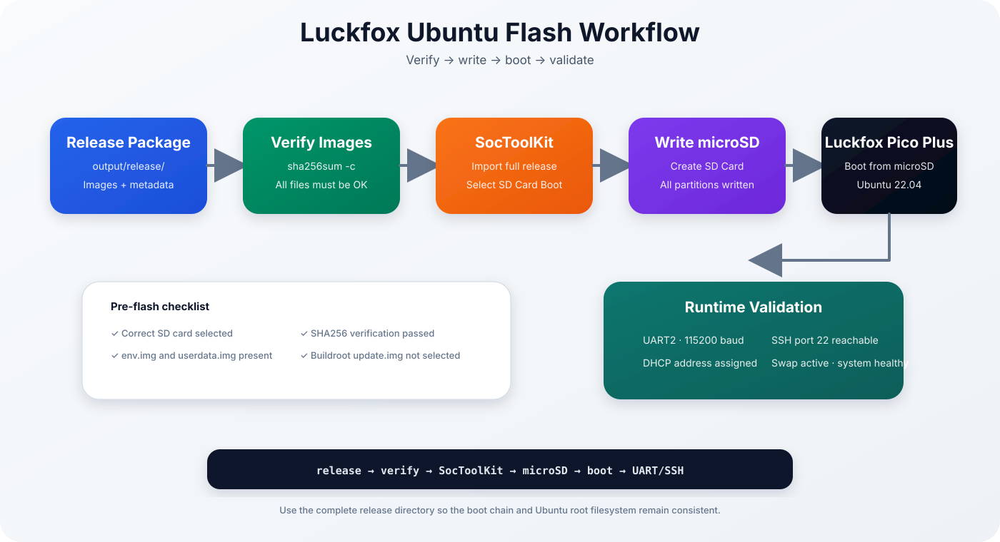
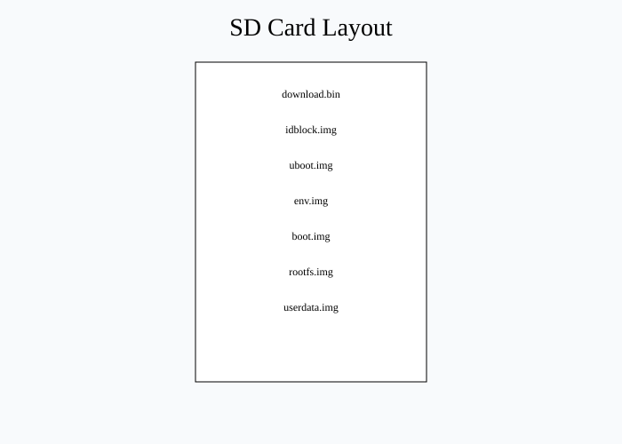
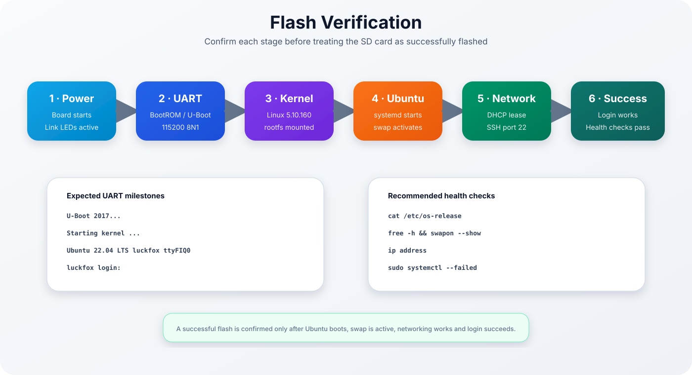
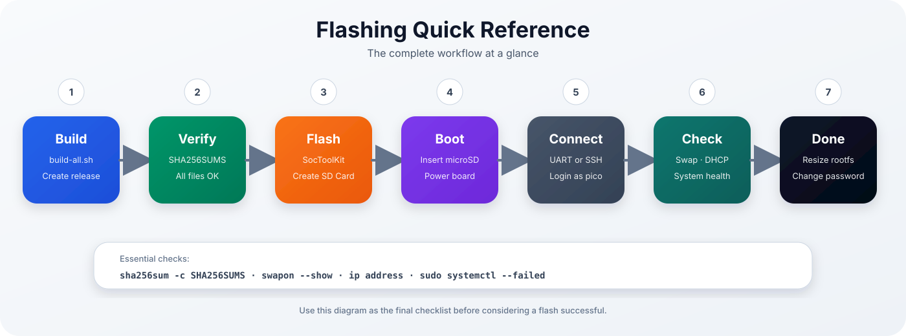

# Ubuntu 22.04 for Luckfox Pico Plus

## Flashing Guide

<p align="center">

</p>

> [!NOTE]
> This guide explains how to safely flash the generated Ubuntu firmware to a microSD card using the official Luckfox SocToolKit and verify a successful first boot.

| Previous | Home | Next |
|-----------|------|------|
| [← Build System](build-system.md) | [README](../README.md) | [First Boot →] (first-boot.md) |

---

# Table of Contents

- Before You Start
- Verify the Release
- Release Directory
- SD Card Layout
- Why we don't use update.img
- Flashing with SocToolKit
- First Boot Verification
- Post Boot Checklist
- Troubleshooting
- Quick Reference

---

# Before You Start

Ensure the following items are available:

- Ubuntu firmware successfully built
- `output/release/` contains all required images
- SHA256 verification completed
- Official Luckfox SocToolKit installed
- microSD card (8 GB or larger)
- USB-to-TTL adapter recommended

> [!IMPORTANT]
> Never flash images that failed checksum verification.

---

# Verify the Release

```bash
cd output/release
sha256sum -c SHA256SUMS
```

Every image should report:

```text
OK
```

---

# Release Directory

| File | Description |
|------|-------------|
| download.bin | Rockchip USB loader |
| idblock.img | DDR initialization |
| uboot.img | U-Boot bootloader |
| env.img | U-Boot environment |
| boot.img | Linux kernel + Device Tree |
| rootfs.img | Ubuntu 22.04 root filesystem |
| userdata.img | Writable user partition |
| manifest.txt | Build metadata |
| SHA256SUMS | Integrity verification |

---

# SD Card Layout

<p align="center">

</p>

The images are written individually. This keeps the Ubuntu userspace separated from the vendor boot chain.

---

# Why we don't use update.img

The original Luckfox Buildroot SDK produces `update.img`.

This Ubuntu project intentionally **does not** use that image.

Reasons:

- Ubuntu replaces the Buildroot userspace.
- Individual images are easier to inspect and verify.
- The bootloader and kernel remain vendor supplied.
- SocToolKit handles the individual images directly.

---

# Flashing with SocToolKit

1. Start SocToolKit with administrator privileges.
2. Insert the target microSD card.
3. Select **Create SD Card**.
4. Open the `output/release/` directory.
5. Verify all required images are detected.
6. Start the flashing process.
7. Wait until the write process finishes successfully.

> [!WARNING]
> The selected SD card will be erased completely.

---

# First Boot Verification

<p align="center">

</p>

Connect:

- Ethernet
- USB-C power
- UART2 (115200 baud, recommended)

Login:

```bash
ssh pico@<board-ip>
```

or via UART:

```text
luckfox login: pico
```

---

# Post Boot Checklist

Verify the installation:

```bash
cat /etc/os-release
uname -a
free -h
swapon --show
ip address
df -h
systemctl --failed
```

Recommended first steps:

```bash
sudo resize2fs /dev/mmcblk1p6
passwd
sudo apt update
```

---

# Troubleshooting

| Problem | Possible Cause | Solution |
|---------|----------------|----------|
| Missing `userdata.img` | Release pipeline incomplete | Rebuild firmware |
| Missing `env.img` | Reference firmware missing | Recreate release package |
| SSH login fails | No DHCP or wrong password | Check UART output and network |
| Login terminated | OOM before swap | Verify swap activation |
| Kernel panic | Wrong rootfs | Flash generated `rootfs.img` |
| No serial output | Wrong UART pins | Use UART2 at 115200 baud |

---

# Flashing Checklist

- ✅ SHA256 verified
- ✅ All release images present
- ✅ Correct SD card selected
- ✅ Flash completed successfully
- ✅ UART boot verified
- ✅ SSH login successful
- ✅ Root filesystem expanded
- ✅ Password changed

---

## Quick Reference

<p align="center">
  
</p>

---

## Continue Reading

| Previous | Home | Next |
|-----------|------|------|
| [← Build System](build-system.md) | [README](../README.md) | [First Boot →](first-boot.md) |
