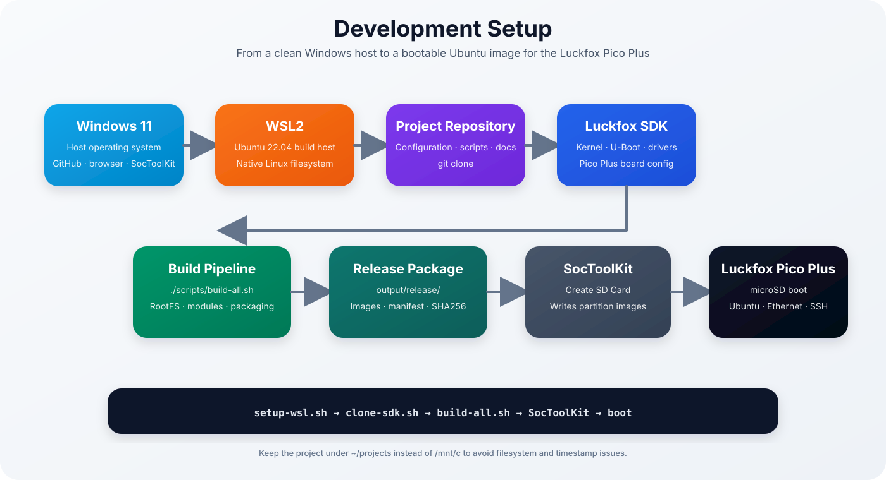

<p align="center">

# Ubuntu 22.04 for Luckfox Pico Plus

### Getting Started



</p>

> [!NOTE]
> This guide walks through the complete setup process, from preparing the build environment to booting Ubuntu on the Luckfox Pico Plus for the first time.

| Previous | Home | Next |
|-----------|------|------|
| [← Introduction](introduction.md) | [README](../README.md) | [Build System →](build-system.md) |

---

## Table of Contents

- [Prerequisites](#prerequisites)
- [Hardware Requirements](#hardware-requirements)
- [Software Requirements](#software-requirements)
- [Clone the Repository](#clone-the-repository)
- [Install the Build Environment](#install-the-build-environment)
- [Download the SDK](#download-the-official-luckfox-sdk)
- [Build Ubuntu](#build-ubuntu)
- [Build Output](#build-output)
- [Flash the SD Card](#flash-the-sd-card)
- [First Boot](#first-boot)
- [Verify the Installation](#verify-the-installation)
- [Troubleshooting](#troubleshooting)
- [Next Steps](#next-steps)

---

## Prerequisites

This guide assumes a clean development environment.

The project is developed and tested primarily on **Windows 11 with WSL2 running Ubuntu 22.04 LTS**. A native Ubuntu 22.04 installation can be used as well.

> [!TIP]
> Build the project inside the native Linux filesystem, for example under `~/projects`, instead of `/mnt/c`. This improves performance and avoids permission, symbolic-link and timestamp issues during compilation.

---

## Hardware Requirements

Required hardware:

- Luckfox Pico Plus (RV1103)
- microSD card with at least 8 GB
- USB-C power cable
- Ethernet connection
- SD card reader

Recommended hardware:

- USB-to-TTL serial adapter with 3.3 V logic
- spare microSD card for testing
- direct access to the DHCP lease table of the local network

> [!WARNING]
> Never connect the 5 V output of a USB-to-TTL adapter to the Luckfox Pico Plus. Connect only `GND`, adapter `RXD` to board `UART2_TX`, and adapter `TXD` to board `UART2_RX`.

---

## Software Requirements

| Component | Recommended version |
|-----------|---------------------|
| Windows | Windows 11 |
| WSL | WSL2 |
| Linux build host | Ubuntu 22.04 LTS |
| Git | Current distribution version |
| Python | Python 3 |
| Luckfox SDK | Official current SDK |
| SocToolKit | Version compatible with RV1103/RV1106 |

Most Linux packages are installed automatically by the project setup script.

---

## Clone the Repository

Clone the project into the Linux home directory:

```bash
mkdir -p ~/projects
cd ~/projects

git clone https://github.com/<YOUR_USERNAME>/luckfox-pico-plus-ubuntu.git
cd luckfox-pico-plus-ubuntu
```

The repository contains the versioned configuration, scripts and documentation. Generated root filesystems and firmware images are intentionally excluded from Git.

---

## Install the Build Environment

Install the required build packages:

```bash
./scripts/setup-wsl.sh
```

The setup script installs tools such as:

- `debootstrap`
- `qemu-user-static`
- `rsync`
- `git`
- `build-essential`
- `e2fsprogs`
- `parted`
- `wget`
- `curl`

> [!IMPORTANT]
> Do not continue until the setup script has completed without errors.

### Use a clean Linux `PATH`

Buildroot can fail if Windows paths containing spaces are inherited by WSL. For a temporary clean build environment, use:

```bash
export PATH=/usr/local/sbin:/usr/local/bin:/usr/sbin:/usr/bin:/sbin:/bin
```

To disable Windows path injection permanently, add the following to `/etc/wsl.conf`:

```ini
[interop]
appendWindowsPath=false
```

Then restart WSL from PowerShell:

```powershell
wsl --shutdown
```

---

## Download the Official Luckfox SDK

Clone or download the official Luckfox SDK:

```bash
./scripts/clone-sdk.sh
```

Select the board configuration:

```bash
cd sdk
./build.sh lunch
```

Choose:

```text
[2] RV1103_Luckfox_Pico_Plus
```

Use the microSD-card Buildroot configuration as the reference board configuration.

Return to the project root:

```bash
cd ..
```

---

## Build Ubuntu

Generate the complete Ubuntu firmware release:

```bash
./scripts/build-all.sh
```

The pipeline performs the following stages:

1. Optimize the Ubuntu root filesystem
2. Integrate Luckfox kernel modules
3. Create the ext4 `rootfs.img`
4. Add the 512 MB swapfile
5. Collect firmware images
6. Create the SDTool-compatible release directory
7. Generate release metadata and SHA-256 checksums

For technical details, see [Build System](build-system.md).

---

## Build Output

After a successful build, the release package is available in:

```text
output/release/
```

Typical contents:

```text
.env.txt
boot.img
download.bin
env.img
idblock.img
manifest.txt
rootfs.img
sd_update.txt
SHA256SUMS
tftp_update.txt
uboot.img
userdata.img
VERSION
```

Verify the generated images:

```bash
cd output/release
sha256sum -c SHA256SUMS
```

Every listed image must report:

```text
OK
```

> [!WARNING]
> Do not flash an incomplete release directory or any image that fails checksum verification.

Return to the project root when verification is complete:

```bash
cd ../..
```

---

## Flash the SD Card

Use the official Luckfox SocToolKit on Windows.

1. Start SocToolKit as Administrator.
2. Select the correct SD card.
3. Choose the SD-card boot workflow.
4. Import the complete `output/release/` directory.
5. Confirm that `env`, `idblock`, `uboot`, `boot`, `userdata` and `rootfs` are detected.
6. Select **Create SD Card**.

> [!CAUTION]
> The selected SD card is overwritten completely. Verify the drive carefully before starting the write process.

Do not flash the old `update.img` or `sd_update.img` from the Buildroot reference build. Those files contain the original Buildroot userspace.

Detailed instructions are provided in [Flashing](flashing.md).

---

## First Boot

<p align="center">


</p>

Before applying power:

- insert the prepared microSD card
- connect Ethernet
- connect the UART2 serial adapter if available
- open the serial terminal at `115200 8N1` with flow control disabled

Power the board through USB-C and allow approximately one minute for the initial boot.

The board should receive an IP address from the network DHCP server.

Login through SSH:

```bash
ssh pico@<board-ip>
```

Alternatively, use the UART console:

```text
luckfox login: pico
```

> [!IMPORTANT]
> The swapfile is required on this low-memory system. During the first boot, confirm through UART that swap is activated before diagnosing login failures.

---

## Verify the Installation

After logging in, verify the system:

```bash
cat /etc/os-release
uname -a
free -h
swapon --show
ip address
df -h
sudo systemctl --failed
```

Expected results:

- Ubuntu 22.04 LTS userspace
- Linux 5.10.160
- Ethernet interface with an IP address
- approximately 512 MB of active swap
- SSH and serial login available

Expand the root filesystem to use the complete rootfs partition:

```bash
sudo resize2fs /dev/mmcblk1p6
df -h /
```

Change the user password immediately:

```bash
passwd
```

Optionally set a new root password:

```bash
sudo passwd root
```

---

## Troubleshooting

Common first-build and first-boot issues include:

- WSL clock skew
- Windows directories in `PATH`
- QEMU `Exec format error`
- Buildroot patch-state conflicts
- missing `env.img`
- missing `userdata.img`
- wrong root filesystem selected in SocToolKit
- login killed by the OOM killer
- SSH authentication failures

See [Troubleshooting](troubleshooting.md) for detailed solutions.

---

## Next Steps

The development environment is now ready and the Luckfox Pico Plus should be running Ubuntu 22.04.

Continue with [Build System](build-system.md) to understand how the SDK, Ubuntu root filesystem, kernel modules and release images are combined.

---

## Continue Reading

| Previous | Home | Next |
|-----------|------|------|
| [← Introduction](introduction.md) | [README](../README.md) | [Build System →](build-system.md) |
