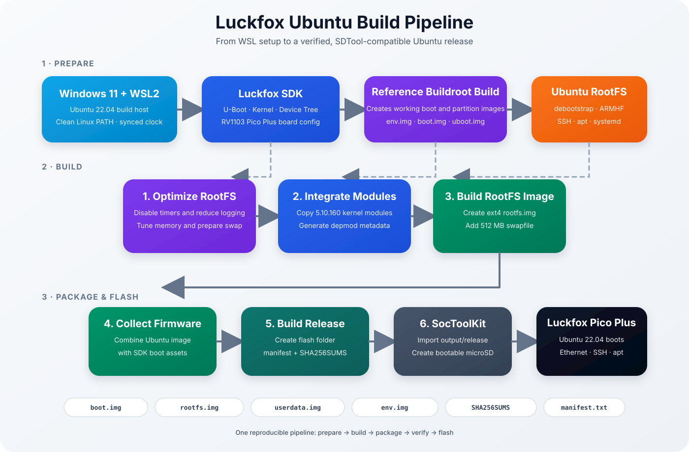

# Introduction

Welcome to **Ubuntu 22.04 for Luckfox Pico Plus**.

This project provides a reproducible way to build and deploy a minimal Ubuntu 22.04 LTS system for the **Luckfox Pico Plus (RV1103)** while continuing to use the official Luckfox SDK, Linux kernel and board support package.

The goal is not to replace the vendor SDK. Instead, the project extends it with a familiar Ubuntu userspace that is easier to maintain and more suitable for software development.

---

# Motivation

The official Luckfox SDK is based on **Buildroot**.

Buildroot is an excellent choice for dedicated embedded devices. It creates small, efficient and highly customized Linux systems.

However, many developers eventually require functionality that is much easier to obtain from a complete Linux distribution.

Typical examples include:

- installing software through `apt`
- running Python applications
- using standard Linux development tools
- compiling software directly on the target
- creating gateways and automation systems
- experimenting with networking software
- rapid application prototyping

Rebuilding an entire Buildroot image for every package change quickly becomes time consuming.

Ubuntu already provides thousands of precompiled packages that can be installed in seconds.

This project combines these advantages with the hardware support already provided by the Luckfox SDK.

---

# Project Goals

The project follows several design goals.

## Reproducible

Every firmware image should be reproducible from source.

No manual modifications should be required after cloning the repository.

---

## Compatible

The original Luckfox bootloader, kernel, drivers and board support package remain untouched.

Whenever possible, improvements are implemented entirely within the Ubuntu userspace.

---

## Automated

The complete build process is automated.

Running

```bash
./scripts/build-all.sh
```

should generate a complete release package without requiring additional manual steps.

---

## Documented

Every step of the build process is documented.

The repository should be understandable even for developers who have never worked with Rockchip hardware before.

---

## Lightweight

The Luckfox Pico Plus provides only a very limited amount of memory.

Ubuntu therefore has to be carefully optimized in order to remain usable.

Examples include:

- swap support
- reduced systemd footprint
- volatile logging
- disabled maintenance timers
- optimized memory configuration

---

# Project Architecture

The project is built around two independent components.

## Luckfox SDK

The official SDK provides:

- U-Boot
- Linux kernel
- Device Tree
- hardware drivers
- firmware creation tools

These components remain unchanged.

---

## Ubuntu Root Filesystem

The Ubuntu userspace provides:

- Ubuntu 22.04 LTS
- ARMHF userspace
- OpenSSH
- apt package management
- systemd
- standard Linux environment

The root filesystem is generated automatically using **debootstrap**.

---

# Build Pipeline

The following diagram illustrates the overall architecture.

> See **docs/images/luckfox-ubuntu-architecture.svg**

<p align="center">
  
</p>


# Current Status

The project is currently under active development.

Already implemented:

| Feature | Status |
|----------|--------|
| Ubuntu 22.04 | ✅ |
| Linux Kernel | ✅ |
| Ethernet | ✅ |
| SSH | ✅ |
| apt | ✅ |
| Automated RootFS generation | ✅ |
| Automated firmware packaging | ✅ |
| Release pipeline | ✅ |
| Swap support | ✅ |

Work in progress:

| Feature | Status |
|----------|--------|
| GPIO helper library | 🚧 |
| Camera support | 🚧 |
| Automatic filesystem expansion | 🚧 |
| CI/CD build pipeline | 🚧 |

---

# Intended Audience

This project is intended for developers who want to use the Luckfox Pico Plus as a general-purpose embedded Linux platform.

Typical applications include:

- IoT gateways
- automation systems
- industrial controllers
- edge computing
- network appliances
- Linux software development
- embedded Python applications
- educational projects

---

# Repository Structure

The repository is organized into several independent components.

```
README.md

config/
    Project configuration

docs/
    Complete project documentation

docs/images/
    Architecture diagrams

scripts/
    Build automation

sdk/
    Official Luckfox SDK

rootfs/
    Generated Ubuntu root filesystem

output/
    Generated firmware images
```

Only the generated images and the Ubuntu root filesystem are excluded from version control.

---

# Next Steps

Continue with:

- **02 Getting Started**
- **03 Build System**
- **04 Flashing**
- **05 First Boot**
- **06 Memory Optimization**
- **07 Troubleshooting**