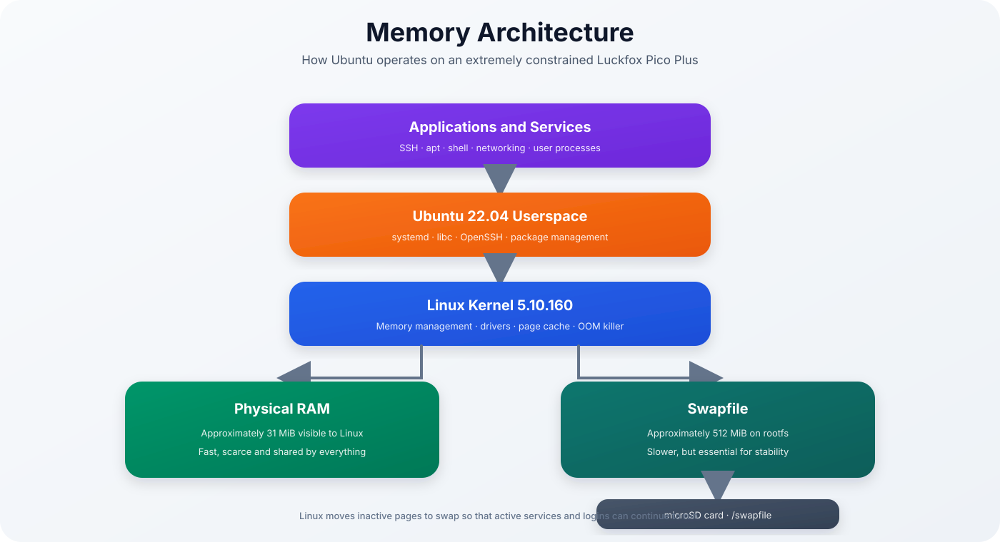
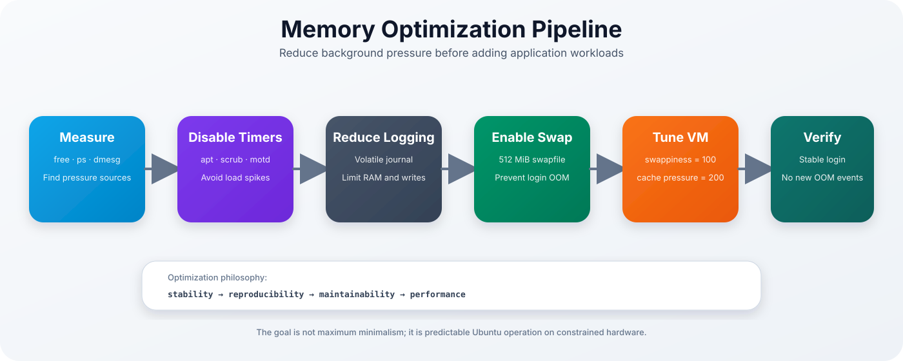
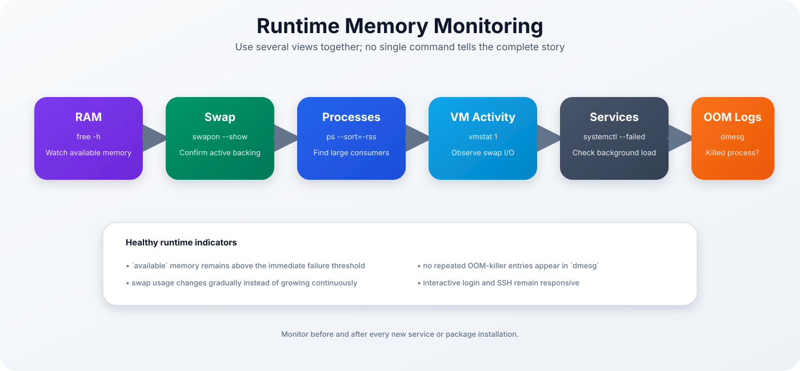
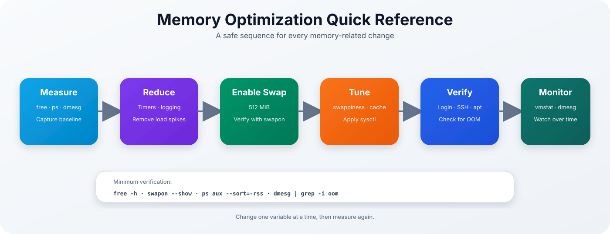

<p align="center">

# Ubuntu 22.04 for Luckfox Pico Plus

### Memory Optimization Guide



</p>

> [!NOTE]
> This document explains the memory constraints of the Luckfox Pico Plus and the optimizations used to keep Ubuntu, systemd, SSH and package management operational.

| Previous | Home | Next |
|-----------|------|------|
| [← First Boot](first-boot.md) | [README](../README.md) | [Troubleshooting →](troubleshooting.md) |

---

## Table of Contents

- [Why Optimization Is Required](#why-optimization-is-required)
- [Optimization Philosophy](#optimization-philosophy)
- [Memory Architecture](#memory-architecture)
- [RAM, Cache and Available Memory](#ram-cache-and-available-memory)
- [Swap Strategy](#swap-strategy)
- [Optimization Pipeline](#optimization-pipeline)
- [Disabled Timers and Services](#disabled-timers-and-services)
- [Journald Optimization](#journald-optimization)
- [Virtual Memory Tuning](#virtual-memory-tuning)
- [Understanding the OOM Killer](#understanding-the-oom-killer)
- [Runtime Monitoring](#runtime-monitoring)
- [Evaluating New Workloads](#evaluating-new-workloads)
- [Recommended and Discouraged Workloads](#recommended-and-discouraged-workloads)
- [Troubleshooting](#troubleshooting)
- [Quick Reference](#quick-reference)

---

## Why Optimization Is Required

The Luckfox Pico Plus has very limited physical memory. Although the board is commonly described as having more installed RAM, the current kernel and board configuration expose only approximately:

```text
31 MiB
```

to Linux userspace.

That memory must be shared by:

- the Linux kernel
- device drivers
- page cache
- systemd
- networking
- SSH
- login processes
- applications

A standard Ubuntu installation is not designed for this operating envelope. Without optimization, even a login process can trigger the kernel OOM killer.

A real failure observed during development looked like:

```text
Out of memory: Killed process 306 (login)
```

The project therefore treats memory configuration as a required part of the firmware build, not an optional post-install tweak.

---

## Optimization Philosophy

The goal is not to remove as many Ubuntu components as possible.

The priorities are:

1. **Stability**
2. **Reproducibility**
3. **Maintainability**
4. **Performance**

The system should remain recognizably Ubuntu and continue to support:

- `apt`
- systemd
- OpenSSH
- standard shell tools
- predictable package management

Optimizations are limited to components that provide little value on this board or create unacceptable background memory and I/O spikes.

> [!IMPORTANT]
> Removing random packages may save a small amount of storage but can make future updates and debugging significantly harder.

---

## Memory Architecture

The physical RAM and swapfile serve different purposes.

### Physical RAM

Physical RAM is fast and should contain:

- actively executing code
- current process working sets
- kernel data
- network buffers
- frequently accessed filesystem data

### Swap

Swap is much slower, but it provides space for inactive anonymous pages that would otherwise force the OOM killer to terminate a process.

The current project configures:

```text
approximately 512 MiB swap
```

inside the Ubuntu root filesystem.

> [!NOTE]
> Swap does not make the CPU or storage faster. It makes memory exhaustion less abrupt and allows essential services to survive temporary peaks.

---

## RAM, Cache and Available Memory

Use:

```bash
free -h
```

Example:

```text
               total        used        free      shared  buff/cache   available
Mem:            31Mi        13Mi       1.0Mi       0.0Ki        17Mi        15Mi
Swap:          511Mi        11Mi       500Mi
```

The most important value is usually:

```text
available
```

not `free`.

Linux intentionally uses otherwise idle RAM as page cache. Cache can be reclaimed when applications need memory.

In the example above:

- only 1 MiB is completely unused
- approximately 15 MiB can still be made available to applications
- 11 MiB has already moved to swap

This is expected and is not automatically a problem.

---

## Swap Strategy

Check active swap:

```bash
swapon --show
```

Check the configured entry:

```bash
grep '^/swapfile ' /etc/fstab
```

The expected entry is similar to:

```text
/swapfile none swap sw,pri=100 0 0
```

Verify the file:

```bash
ls -lh /swapfile
sudo file /swapfile
```

Activate it manually if required:

```bash
sudo swapon /swapfile
```

Disable it temporarily:

```bash
sudo swapoff /swapfile
```

> [!WARNING]
> Do not disable swap on the Luckfox Pico Plus during normal operation. Login, SSH and package operations may fail immediately under memory pressure.

### microSD Wear

Swap creates write traffic on the microSD card.

To reduce wear:

- install only required services
- avoid continuous high-memory workloads
- avoid repeated package builds on the target
- use a reliable, high-endurance microSD card
- monitor swap I/O with `vmstat`

The current swapfile is a stability mechanism, not a substitute for sufficient hardware resources.

---

## Optimization Pipeline

<p align="center">



</p>

The image build applies memory-related changes through:

```text
scripts/optimize-rootfs.sh
```

This keeps the configuration reproducible and avoids manual post-install changes.

---

## Disabled Timers and Services

The image disables maintenance tasks that can create background load at unpredictable times.

Typical disabled timers include:

| Unit | Reason |
|------|--------|
| `apt-daily.timer` | Avoid automatic package-index activity |
| `apt-daily-upgrade.timer` | Avoid unattended upgrade memory spikes |
| `dpkg-db-backup.timer` | Avoid periodic package database work |
| `e2scrub_all.timer` | Avoid filesystem scrub activity |
| `fstrim.timer` | Not essential for the current microSD workflow |
| `motd-news.timer` | Avoid network and login overhead |

The related service:

```text
e2scrub_reap.service
```

is also disabled.

These operations can still be performed manually when sufficient memory and time are available.

Manual package maintenance:

```bash
sudo apt update
sudo apt upgrade
```

> [!TIP]
> Run package maintenance from an active UART or SSH session so that memory pressure and failures are immediately visible.

---

## Journald Optimization

Persistent logging consumes storage and can create unnecessary write traffic.

The project configures journald with:

```ini
[Journal]
Storage=volatile
RuntimeMaxUse=4M
RuntimeKeepFree=2M
Compress=no
```

This means:

- logs are stored in RAM
- logs disappear after reboot
- journal memory is limited
- compression overhead is avoided

Check current usage:

```bash
journalctl --disk-usage
```

Check the active configuration:

```bash
systemd-analyze cat-config systemd/journald.conf
```

> [!NOTE]
> Volatile logs are appropriate for an experimental embedded system, but they reduce forensic history after a reboot. Capture important logs remotely when diagnosing intermittent problems.

---

## Virtual Memory Tuning

The project installs:

```text
/etc/sysctl.d/99-luckfox-memory.conf
```

with:

```ini
vm.swappiness=100
vm.vfs_cache_pressure=200
```

Apply the settings:

```bash
sudo sysctl --system
```

Verify:

```bash
sysctl vm.swappiness
sysctl vm.vfs_cache_pressure
```

### `vm.swappiness=100`

A higher swappiness encourages the kernel to move inactive anonymous pages to swap earlier instead of waiting until RAM is nearly exhausted.

On this board, preserving a small amount of physical RAM for active processes is more important than avoiding all swap activity.

### `vm.vfs_cache_pressure=200`

A higher cache pressure encourages faster reclamation of inode and directory caches.

This can help on systems where application memory is more valuable than retaining large filesystem metadata caches.

> [!IMPORTANT]
> These values are project defaults, not universal recommendations. Re-test them if the workload changes substantially.

---

## Understanding the OOM Killer

When Linux cannot satisfy a memory allocation and reclaim or swap cannot provide enough space, it selects a process to terminate.

Search the kernel log:

```bash
dmesg | grep -i -E 'oom|out of memory|killed process'
```

Example:

```text
Out of memory: Killed process 306 (login)
```

This does not necessarily mean the terminated program is defective. It means the system could not continue without freeing memory immediately.

### Common OOM Triggers

- login while swap is inactive
- package installation
- large Python imports
- multiple SSH sessions
- automatic apt tasks
- verbose logging
- memory leaks
- starting several services at once

### Response Procedure

1. Keep UART connected.
2. Confirm swap status.
3. Identify the largest RSS consumers.
4. Stop nonessential services.
5. Review recent kernel messages.
6. Reboot only after collecting evidence.

Useful commands:

```bash
free -h
swapon --show
ps aux --sort=-rss | head -15
dmesg | tail -n 100
```

---

## Runtime Monitoring

<p align="center">



</p>

### Memory Summary

```bash
free -h
```

### Largest Processes

```bash
ps aux --sort=-rss | head -15
```

### Continuous VM Activity

```bash
vmstat 1
```

Important columns:

| Column | Meaning |
|--------|---------|
| `si` | Swap data read into RAM |
| `so` | RAM pages written to swap |
| `r` | Runnable processes |
| `b` | Processes blocked on I/O |
| `free` | Completely unused memory |

Continuous high `si` and `so` values indicate swap thrashing.

### Service State

```bash
sudo systemctl --failed
sudo systemctl list-units --type=service --state=running
```

### Kernel Events

```bash
dmesg | grep -i -E 'oom|killed process|memory|error|fail'
```

---

## Evaluating New Workloads

Before installing a new service, capture a baseline:

```bash
free -h
swapon --show
ps aux --sort=-rss | head -15
```

Install or start only one new component.

Then repeat the measurements.

A workload should be considered unsuitable when it causes:

- repeated OOM-killer events
- constant swap growth
- sustained swap input and output
- unresponsive SSH sessions
- excessively long package operations
- failure of essential services

> [!TIP]
> Prefer cross-compilation or building packages on the WSL host instead of compiling directly on the Luckfox board.

---

## Recommended and Discouraged Workloads

### Reasonable Workloads

- small shell scripts
- lightweight C or C++ daemons
- simple MQTT clients
- small HTTP endpoints
- GPIO and sensor services
- monitoring agents with low memory use
- basic network utilities

### Workloads Requiring Careful Testing

- Python applications
- Node.js services
- database clients
- camera pipelines
- TLS-heavy services
- multiple concurrent SSH sessions

### Generally Discouraged

- desktop environments
- Docker
- local software compilation
- large databases
- Node-RED with many extensions
- memory-intensive AI frameworks
- large Python scientific packages

The board can run Ubuntu tools, but it does not become a general-purpose server.

---

## Troubleshooting

| Symptom | Likely cause | Recommended action |
|---------|--------------|--------------------|
| Login closes immediately | OOM condition | Confirm swap is active |
| SSH becomes unresponsive | Memory or storage pressure | Check `free`, `vmstat` and UART |
| Swap remains at zero during pressure | Swapfile not enabled | Check `/etc/fstab` and `swapon` |
| Swap grows continuously | Workload exceeds practical capacity | Stop or replace the workload |
| `systemctl daemon-reload` refuses | `/run/systemd` safety reserve | Persist changes and reboot |
| Package install is killed | apt/dpkg memory spike | Stop services and retry one package |
| High microSD writes | Frequent swap or logging | Reduce workload and inspect `vmstat` |
| OOM after adding service | New service consumes too much RSS | Disable it and review alternatives |

### Inspect `/run`

```bash
df -h /run
mount | grep ' on /run '
```

A small `/run` tmpfs is expected. Increasing it may consume more precious RAM and is not automatically an improvement.

---

## Engineering Notes

### Why Swap Instead of Removing systemd?

The project aims to remain a familiar Ubuntu environment. Replacing systemd would significantly change the distribution model, service management and package assumptions.

Swap and selective timer reduction solve the immediate stability problem while preserving compatibility.

### Why Volatile Logs?

Persistent logs provide valuable history, but the combination of limited RAM, limited storage performance and experimental development makes a small volatile journal the safer default.

### Why Keep `apt`?

`apt` is one of the main reasons to use Ubuntu rather than Buildroot. The project accepts the cost of package management and instead ensures that package operations are performed deliberately rather than automatically.

---

## Quick Reference

<p align="center">



</p>

---

## Continue Reading

| Previous | Home | Next |
|-----------|------|------|
| [← First Boot](first-boot.md) | [README](../README.md) | [Troubleshooting →](troubleshooting.md) |
