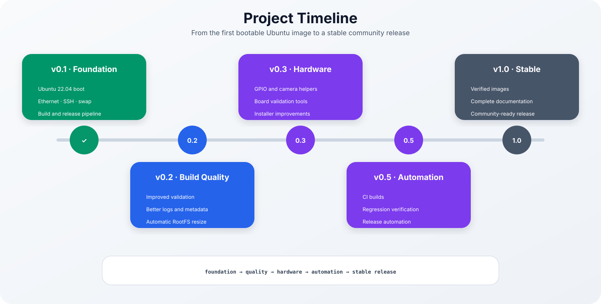
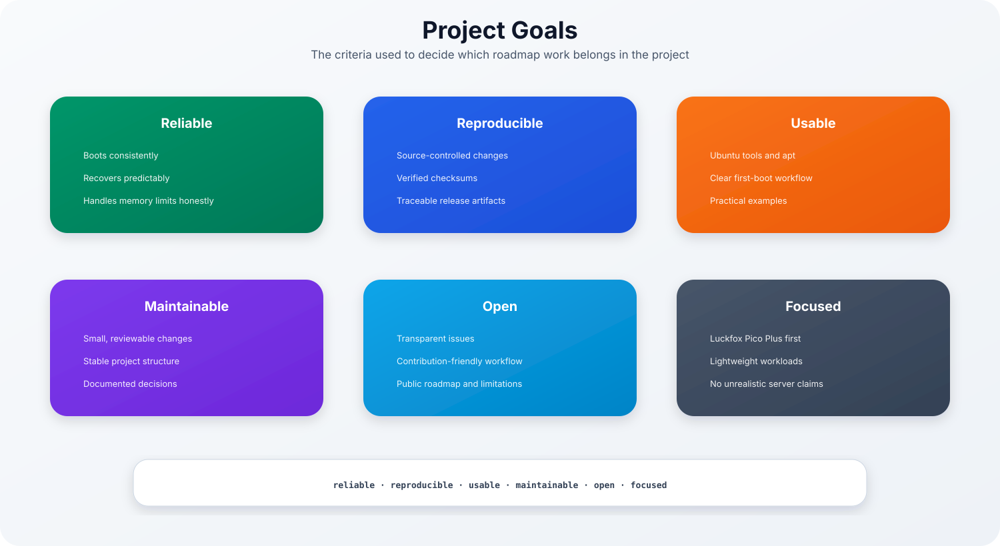
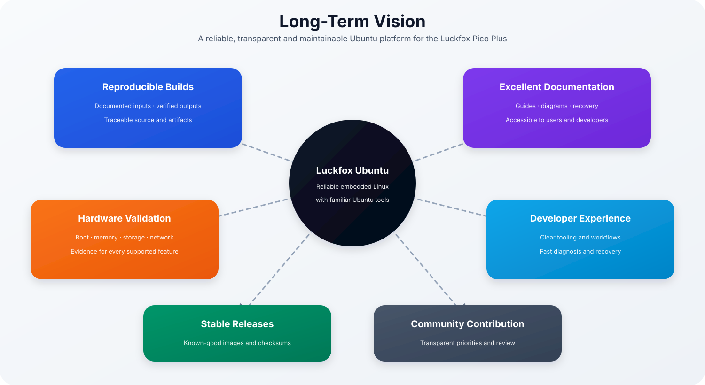
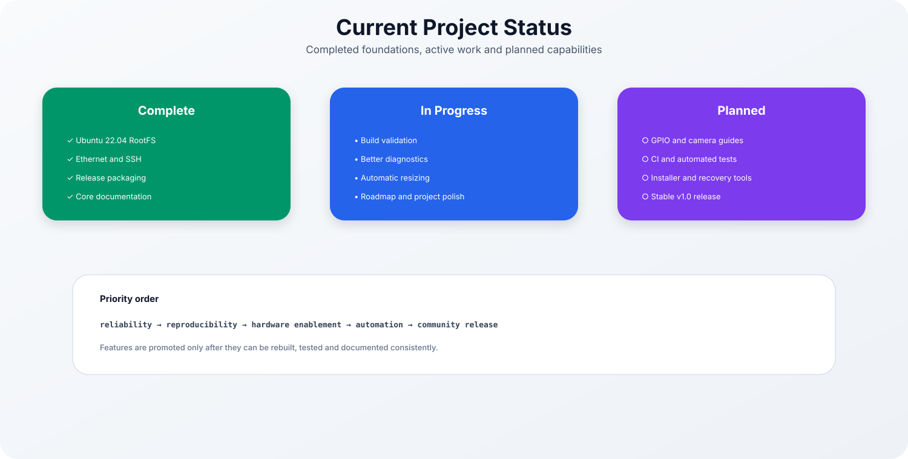
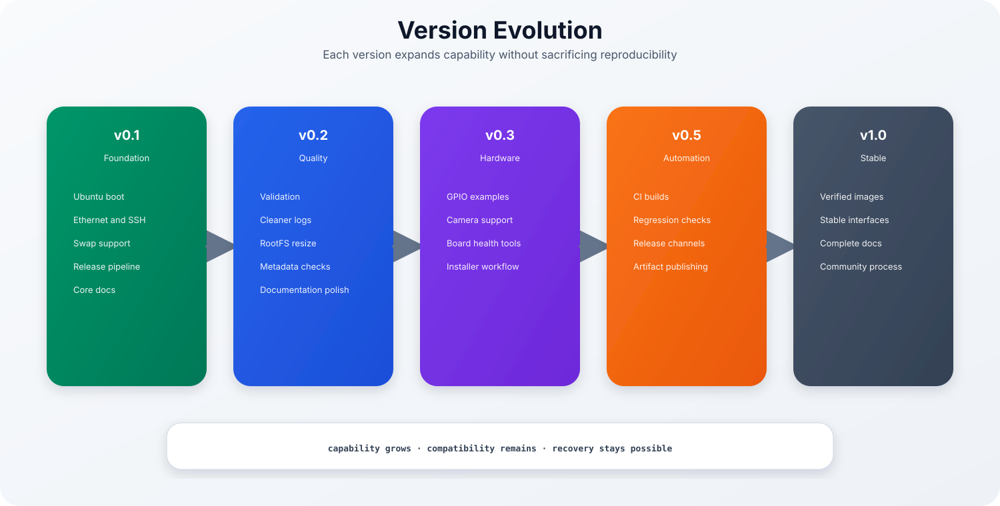
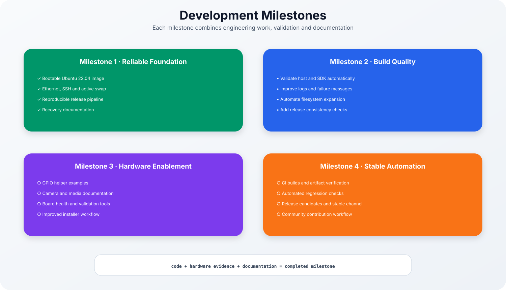
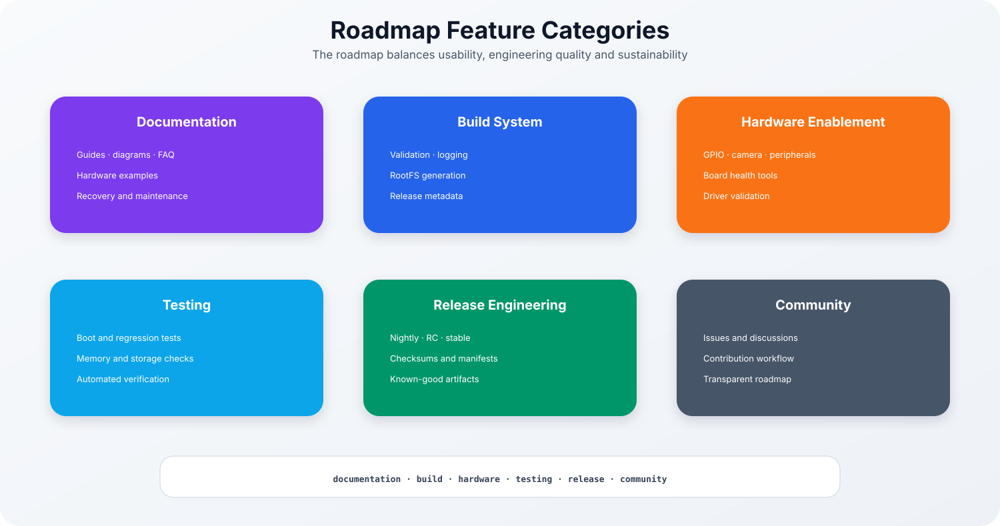
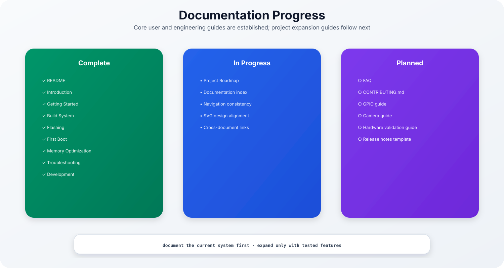
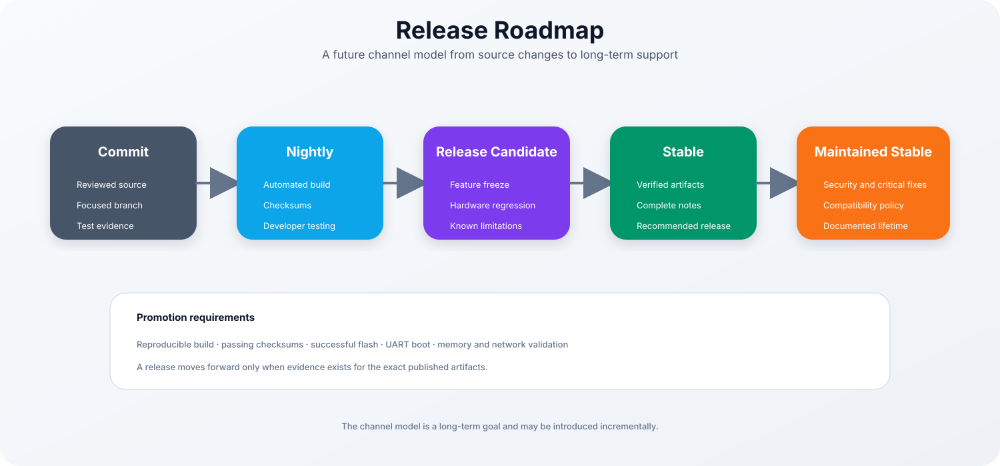
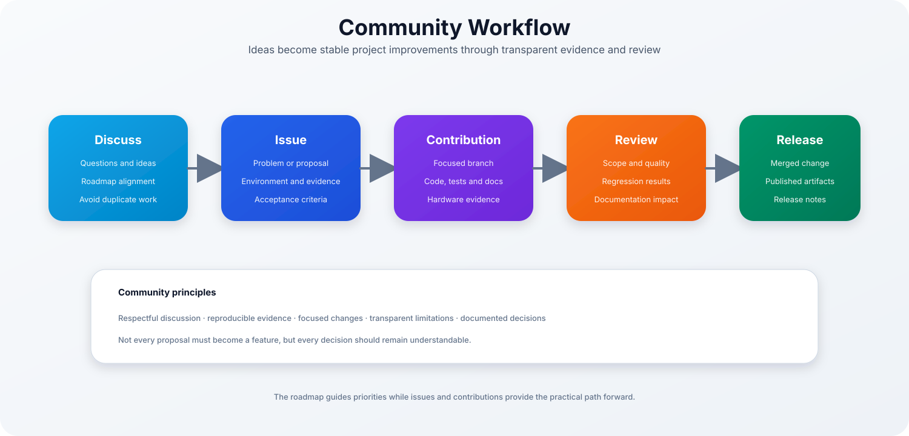

# Ubuntu 22.04 for Luckfox Pico Plus

### Project Roadmap

> [!NOTE]
> This document describes the long-term vision of the project, the current development priorities, planned milestones and engineering goals.
>
> Unlike a traditional feature list, this roadmap explains **why** certain work is prioritised and **how** the project intends to evolve while maintaining reproducibility, reliability and maintainability.

| Previous | Home | Next |
|-----------|------|------|
| [← Development](development.md) | [README](../README.md) | Future Documentation → |

---

# Table of Contents

- Project Vision
- Engineering Philosophy
- Project Principles
- Current Status
- Development Timeline
- Version Evolution
- Development Milestones
- Feature Categories
- Documentation Progress
- Release Strategy
- Community Workflow
- Long-Term Vision
- Project Goals
- Success Metrics
- Risk Assessment
- Definition of Done
- Roadmap Checklist
- Future Documentation
- Closing Notes

---

# Project Vision

The purpose of this project is not merely to create another Linux image for the
Luckfox Pico Plus.

The long-term objective is to provide a **well-engineered Ubuntu platform**
that behaves predictably, is easy to reproduce, and remains maintainable over
many future releases.

The project aims to bridge the gap between lightweight embedded Linux systems
and the familiar Ubuntu ecosystem while keeping the system small enough for the
available hardware resources.

The roadmap therefore prioritises engineering quality over feature count.

---

## Long-Term Objectives

The project is built around six strategic objectives.

### Reliable

The operating system should boot reliably every time and recover gracefully
from unexpected situations.

Reliability always has higher priority than introducing new features.

---

### Reproducible

Every released image should be reproducible from the repository.

This includes:

- build scripts
- configuration
- patches
- documentation
- release metadata

No release should depend on undocumented manual work.

---

### Understandable

The project should remain understandable for new contributors.

Documentation is therefore considered an integral part of development rather
than optional project material.

Every significant engineering decision should be documented.

---

### Maintainable

Long-term maintainability requires:

- consistent directory structures
- reusable scripts
- clear naming
- predictable release procedures

Small improvements are preferred over large rewrites.

---

### Transparent

Known limitations should be documented openly.

If a feature is experimental,
the documentation should explain:

- current behaviour
- expected behaviour
- known problems
- future plans

---

### Community Friendly

The project should become approachable for developers with different levels of
embedded Linux experience.

Good documentation lowers the entry barrier more effectively than additional
features.

---

# Engineering Philosophy

The engineering philosophy defines how technical decisions are made.

Unlike feature planning, these principles remain relatively stable over the
lifetime of the project.

---

## Reliability Before Features

New functionality should never reduce overall system stability.

Whenever a trade-off exists between:

- additional features
- predictable behaviour

the predictable solution is preferred.

---

## Reproducibility Over Convenience

Temporary manual fixes often solve immediate problems but create long-term
maintenance issues.

Whenever possible:

- automate
- document
- version-control

instead of relying on manual procedures.

---

## Evidence Before Assumptions

Engineering decisions should be based on observable evidence.

Examples include:

- UART logs
- kernel logs
- build logs
- SHA256 verification
- hardware validation

Guessing should never replace measurement.

---

## Documentation Is Part of the Code

Documentation is developed together with the implementation.

A feature is not considered complete until its behaviour can be understood
without reading the implementation itself.

---

## Small Improvements Win

Large rewrites introduce unnecessary risk.

Instead, development focuses on:

- incremental improvements
- continuous validation
- frequent testing
- measurable progress

This approach reduces regression risk while keeping releases predictable.

---

# Project Principles

The roadmap is guided by several permanent engineering principles.

## Principle 1

Build quality is more important than release frequency.

---

## Principle 2

Every release must be reproducible.

---

## Principle 3

Hardware validation is mandatory.

Software verification alone is not sufficient.

---

## Principle 4

Documentation grows together with the project.

---

## Principle 5

Recovery procedures are part of the design.

Every important operation should have a documented recovery path.

---

## Principle 6

Failures should be diagnosable.

Meaningful logs are preferred over silent failures.

---

## Principle 7

Automation reduces maintenance effort.

Whenever repetitive work appears, it should eventually become scripted.

---

## Principle 8

The project remains approachable.

Complexity should only be introduced when it provides measurable benefits.

---

# Current Status

The project has successfully completed its foundational engineering phase.

The following capabilities are already available:

| Area | Status |
|-------|--------|
| Ubuntu RootFS | ✅ |
| Boot Process | ✅ |
| Ethernet | ✅ |
| SSH | ✅ |
| Swap | ✅ |
| Build Pipeline | ✅ |
| Release Packaging | ✅ |
| Documentation | ✅ |

Current development focuses on improving engineering quality rather than adding
large amounts of new functionality.

Priority areas include:

- build validation
- automated testing
- release consistency
- documentation refinement
- developer experience

---

# Development Timeline

The roadmap is divided into several progressive milestones.

Each milestone expands the project while preserving compatibility with previous
releases.

Rather than introducing isolated features, every milestone strengthens one of
the project's engineering pillars.

# Version Evolution

The project evolves incrementally rather than through disruptive redesigns.

Every release extends the existing foundation while maintaining compatibility,
documentation quality and reproducibility.

The intention is that each version remains understandable to users upgrading
from previous releases.

---

## Version 0.1 – Foundation

The initial release establishes the technical foundation.

Major achievements include:

- Ubuntu 22.04 RootFS
- functional boot process
- Ethernet networking
- SSH access
- swap support
- automated build pipeline
- release packaging
- engineering documentation

The objective of v0.1 is stability rather than completeness.

---

## Version 0.2 – Engineering Quality

Version 0.2 concentrates on improving engineering quality.

Primary objectives include:

- improved build validation
- better diagnostic output
- automatic RootFS expansion
- release consistency verification
- metadata improvements
- enhanced error handling

The user experience should improve without changing the overall architecture.

---

## Version 0.3 – Hardware Enablement

The next development stage focuses on board functionality.

Examples include:

- GPIO examples
- camera integration
- peripheral documentation
- board diagnostics
- hardware validation tools

Documentation will evolve together with each supported subsystem.

---

## Version 0.5 – Automation

Once the core platform is stable, development shifts toward automation.

Examples:

- CI builds
- regression testing
- automatic validation
- release candidates
- automated artifact generation

Automation should reduce repetitive manual work while improving release quality.

---

## Version 1.0 – Stable Release

The first stable release represents engineering maturity rather than feature
completeness.

The release should provide:

- reproducible builds
- verified firmware
- complete documentation
- stable release procedures
- validated hardware support

Version 1.0 marks the beginning of long-term maintenance rather than the end of
development.

---

# Development Milestones

Each milestone combines software engineering, documentation and hardware
validation.

No milestone is considered complete until all three aspects have been verified.

---

## Milestone 1

**Reliable Foundation**

Completed:

- Ubuntu boot
- networking
- SSH
- swap
- release images
- documentation

---

## Milestone 2

**Engineering Improvements**

Objectives:

- better validation
- improved logging
- cleaner scripts
- release verification
- safer configuration handling

---

## Milestone 3

**Hardware Expansion**

Objectives:

- GPIO
- cameras
- peripherals
- diagnostics
- installer improvements

---

## Milestone 4

**Automation**

Objectives:

- CI
- regression tests
- release automation
- documentation consistency

---

## Milestone 5

**Stable Release**

Objectives:

- production-quality images
- verified hardware
- complete documentation
- long-term maintenance process

---

# Feature Categories

The roadmap groups future work into several engineering categories.

---

## Documentation

Documentation remains one of the highest priorities.

Future additions include:

- FAQ
- hardware tutorials
- GPIO examples
- camera guide
- recovery examples
- advanced configuration

---

## Build System

The build system will continue evolving through:

- validation
- diagnostics
- improved logging
- safer configuration
- automated downloads

---

## Hardware Support

Future hardware work focuses on:

- GPIO
- camera
- multimedia
- storage
- USB
- debugging tools

---

## Testing

Testing gradually becomes more automated.

Areas include:

- boot verification
- regression testing
- memory validation
- filesystem integrity
- network validation

---

## Release Engineering

Release quality is improved through:

- checksums
- manifests
- reproducible artifacts
- automated metadata
- release verification

---

## Community

Long-term project sustainability depends on community participation.

Future work includes:

- issue templates
- pull request guidelines
- contribution documentation
- release discussions

---

# Documentation Progress

The documentation has reached a level where the complete development workflow
can be reproduced from scratch.

Current completed documents include:

| Document | Status |
|----------|--------|
| README | ✅ |
| Introduction | ✅ |
| Getting Started | ✅ |
| Build System | ✅ |
| Flashing | ✅ |
| First Boot | ✅ |
| Memory Optimization | ✅ |
| Troubleshooting | ✅ |
| Development | ✅ |

Remaining documentation focuses on extending supported hardware and simplifying
future maintenance.

Future documents may include:

- FAQ
- GPIO Guide
- Camera Guide
- Hardware Validation Guide
- Release Notes
- Contribution Guide

---

# Release Strategy

Releases should progress through clearly defined stages.

---

## Development

Features are implemented on dedicated branches.

Every change should include:

- documentation
- validation
- recovery considerations

---

## Nightly Builds

Nightly builds verify that the repository remains buildable.

These builds are intended for developers.

---

## Release Candidates

Release Candidates freeze feature development.

Only bug fixes and documentation updates are accepted.

Regression testing becomes the primary activity.

---

## Stable Releases

Stable releases should be suitable for general users.

Requirements include:

- successful hardware testing
- verified release images
- complete documentation
- published checksums

---

## Maintained Releases

Older stable releases receive:

- critical fixes
- documentation updates
- compatibility corrections

Major architectural changes should not be introduced into maintained releases.

---

> [!TIP]
>
> Every release should be reproducible from the published repository without
> undocumented manual steps.

# Community Workflow

The long-term success of an open-source project depends on a transparent and
predictable contribution process.

The roadmap therefore considers community participation an engineering feature
rather than an administrative task.

Every contribution should improve one or more of the following areas:

- documentation
- build system
- hardware support
- testing
- release quality

---

## Discuss Before Implementing

Larger changes benefit from discussion before implementation.

Typical discussion topics include:

- architecture
- supported hardware
- maintenance impact
- compatibility
- testing strategy

Early discussions usually prevent unnecessary redesigns later.

---

## Evidence-Based Contributions

Every contribution should include evidence.

Examples include:

- UART output
- build logs
- screenshots
- SHA256 verification
- hardware validation
- regression testing

Good evidence makes reviews significantly easier.

---

## Documentation Requirements

Whenever functionality changes, the documentation should be updated together
with the implementation.

Examples include:

- setup instructions
- diagrams
- troubleshooting
- recovery procedures
- release notes

Documentation is reviewed with the same care as source code.

---

# Long-Term Vision

The roadmap extends well beyond the first stable release.

The long-term objective is a lightweight Ubuntu platform that is:

- reproducible
- maintainable
- transparent
- easy to understand
- easy to recover
- pleasant to develop

---

## Future Engineering Goals

Examples include:

### Build Automation

- CI builds
- nightly builds
- release candidates
- automatic verification

---

### Hardware Support

Future documentation may include:

- GPIO
- SPI
- I²C
- camera modules
- USB peripherals
- storage devices

---

### Testing

Future releases should introduce increasingly automated validation.

Examples:

- boot verification
- package validation
- filesystem integrity
- memory monitoring
- regression tests

---

### Documentation

The documentation should eventually cover the complete engineering lifecycle.

Examples include:

- architecture
- release process
- debugging
- maintenance
- contribution workflow

---

# Project Goals

The roadmap is driven by measurable engineering goals rather than feature
quantity.

---

## Goal 1

Reliable releases.

Every published image should boot successfully on supported hardware.

---

## Goal 2

Reproducible builds.

Every release should be rebuildable from the repository.

---

## Goal 3

Comprehensive documentation.

Documentation should explain:

- installation
- operation
- maintenance
- troubleshooting
- recovery

---

## Goal 4

Maintainable engineering.

Small improvements are preferred over large redesigns.

---

## Goal 5

Transparent development.

Known limitations should be documented openly.

---

## Goal 6

Community participation.

The project should remain approachable for developers with different levels of
embedded Linux experience.

---

# Success Metrics

The roadmap defines measurable indicators for project quality.

| Metric | Target |
|----------|---------|
| Successful Build | 100 % |
| Successful Flash | 100 % |
| Successful Boot | 100 % |
| SHA256 Verification | 100 % |
| UART Verification | Every Release |
| Hardware Validation | Every Release |
| Documentation Coverage | >95 % |
| Reproducible Releases | Required |

---

## Quality Indicators

Engineering quality is evaluated through:

- reproducibility
- maintainability
- stability
- documentation completeness
- release consistency

Feature count alone is **not** considered a quality metric.

---

# Risk Assessment

Every long-term project faces technical risks.

The roadmap attempts to minimise these risks through planning and engineering
discipline.

| Risk | Mitigation |
|-------|------------|
| SDK Changes | Version pinning |
| Ubuntu Package Updates | Validation testing |
| Flash Corruption | SHA256 verification |
| Memory Exhaustion | Swap + monitoring |
| Documentation Drift | Update documentation together with implementation |
| Hardware Differences | Hardware validation before release |

---

## Engineering Risks

Major risks include:

- undocumented manual changes
- inconsistent releases
- missing recovery procedures
- insufficient testing

Each risk should be reduced through automation whenever practical.

---

# Definition of Done

A roadmap item is considered complete only when every engineering criterion has
been satisfied.

Checklist:

- [ ] Source committed
- [ ] Documentation updated
- [ ] SVG diagrams updated
- [ ] Clean build completed
- [ ] Successful flash test
- [ ] Successful hardware boot
- [ ] UART verified
- [ ] Regression testing completed
- [ ] Release metadata updated
- [ ] Checksums verified

Completion is defined by evidence, not by implementation alone.

---

# Roadmap Checklist

Current priorities:

- [x] Ubuntu 22.04 RootFS
- [x] Build Pipeline
- [x] Release Packaging
- [x] Documentation
- [x] Troubleshooting Guide
- [x] Development Guide
- [ ] Hardware Expansion
- [ ] Automated Testing
- [ ] Continuous Integration
- [ ] Stable Release

---

# Future Documentation

The documentation will continue expanding as additional hardware and workflows
become supported.

Potential future documents include:

- FAQ
- GPIO Guide
- Camera Guide
- Hardware Validation Guide
- Release Notes
- Contributing Guide
- CI/CD Guide
- Advanced Networking
- Security Hardening
- Performance Tuning

Each new document should follow the established documentation style, including:

- YAML front matter
- consistent navigation
- GitHub callouts
- SVG diagrams
- engineering notes
- troubleshooting references
- best practices

---

# Closing Notes

The purpose of this roadmap is not to predict every future feature.

Instead, it defines a clear engineering direction that keeps the project
maintainable while allowing continuous improvements.

Every future contribution should support one or more of the project's
fundamental objectives:

- reliability
- reproducibility
- maintainability
- transparency
- documentation
- community collaboration

When uncertainty exists, engineering quality should always take precedence over
feature quantity.

---

## Final Engineering Principles

Remember:

1. Reliability before features.
2. Reproducibility over convenience.
3. Evidence before assumptions.
4. Documentation is part of the code.
5. Small improvements outperform large rewrites.
6. Hardware validation is mandatory.
7. Automation reduces maintenance effort.
8. Every release must remain rebuildable.
9. Every change should improve understandability.
10. Long-term maintainability is the ultimate objective.

---

## Continue Reading

| Previous | Home | Next |
|-----------|------|------|
| [← Development](development.md) | [README](../README.md) | Future Documentation |