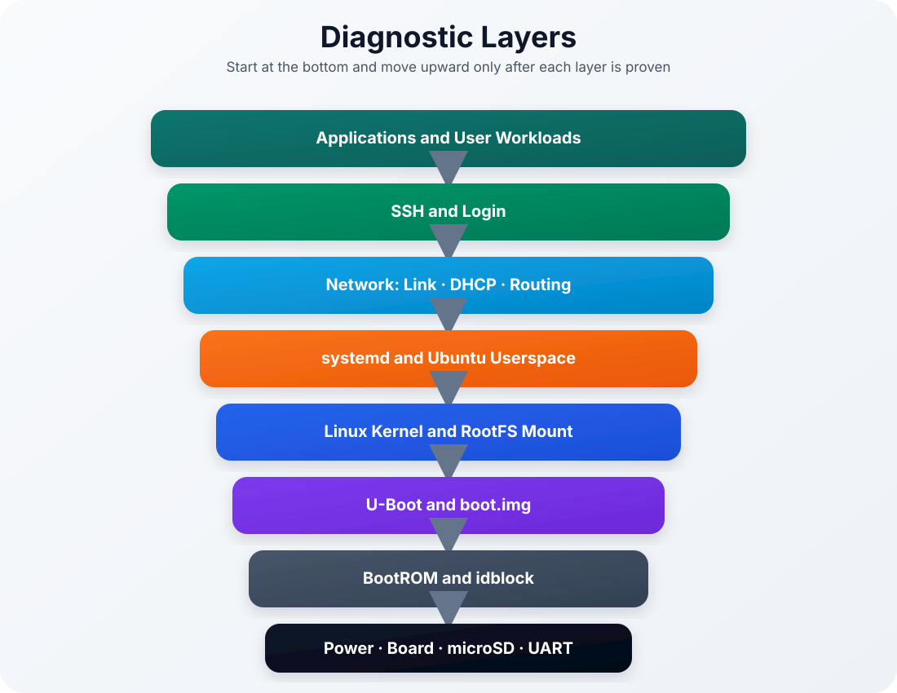
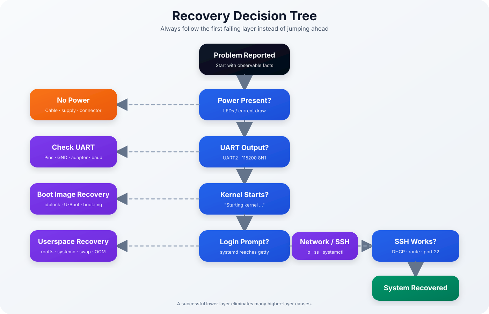

<p align="center">

# Ubuntu 22.04 for Luckfox Pico Plus

### Troubleshooting Guide — Part 3



</p>

> [!NOTE]
> This final troubleshooting chapter focuses on repeatable engineering workflows: layered diagnosis, controlled recovery, maintenance, evidence collection and high-quality issue reports.

| Previous | Home | Next |
|-----------|------|------|
| [← Troubleshooting Part 2](troubleshooting-part2.md) | [README](../README.md) | Documentation Index → |

---

## Table of Contents

- [Recovery Decision Tree](#recovery-decision-tree)
- [Diagnostic Layers](#diagnostic-layers)
- [systemd Debugging](#systemd-debugging)
- [Kernel Debugging](#kernel-debugging)
- [Network Diagnostics](#network-diagnostics)
- [Storage and Filesystem Diagnostics](#storage-and-filesystem-diagnostics)
- [Performance Diagnostics](#performance-diagnostics)
- [Build and Release Diagnostics](#build-and-release-diagnostics)
- [Maintenance Workflow](#maintenance-workflow)
- [Collecting an Issue Bundle](#collecting-an-issue-bundle)
- [Opening a High-Quality GitHub Issue](#opening-a-high-quality-github-issue)
- [Engineering Best Practices](#engineering-best-practices)
- [Maintenance Checklist](#maintenance-checklist)
- [Quick Reference](#quick-reference)

---

## Recovery Decision Tree

<p align="center">



</p>

The decision tree is deliberately ordered from low-level hardware to high-level services.

Use the following rule:

> [!IMPORTANT]
> Do not debug a higher layer until the lower layer beneath it is proven to work.

Examples:

- If there is no power, SSH configuration is irrelevant.
- If UART shows U-Boot but no kernel, the issue is not systemd.
- If a local login works but SSH does not, the root filesystem and most userspace components are already operational.
- If SSH accepts a password and then closes, inspect memory pressure and PAM before changing network configuration.

---

## Diagnostic Layers

The project can be diagnosed as a stack:

| Layer | Evidence that it works | Typical failures |
|-------|-------------------------|------------------|
| Hardware | LEDs, current draw, stable power | cable, supply, board damage |
| BootROM / idblock | earliest UART messages | wrong boot media, damaged idblock |
| U-Boot | U-Boot banner and commands | corrupt `uboot.img`, environment issue |
| Kernel | `Starting kernel`, kernel log | wrong `boot.img`, Device Tree, panic |
| RootFS / systemd | services start, login prompt | damaged rootfs, missing mount, OOM |
| Network | link, DHCP address, default route | cable, DHCP, route, driver |
| SSH / login | port 22, authentication | sshd, PAM, account, OOM |
| Application | service-specific output | package, config, workload capacity |

The highest working layer narrows the search space significantly.

---

## systemd Debugging

### Failed Units

```bash
sudo systemctl --failed
```

### Service Status

```bash
sudo systemctl status <service> --no-pager
```

### Current-Boot Logs

```bash
sudo journalctl -b --no-pager
```

### One Service

```bash
sudo journalctl -u <service> -b --no-pager
```

### Dependency Chain

```bash
systemctl list-dependencies <service>
```

### Enabled Units

```bash
sudo systemctl list-unit-files --state=enabled
```

### Timers

```bash
sudo systemctl list-timers --all
```

> [!NOTE]
> The Luckfox image intentionally disables several automatic maintenance timers. A timer displaying `n/a` is not automatically an error.

### `daemon-reload` Memory Warning

Possible message:

```text
Refusing to reload, not enough space available on /run/systemd.
```

The unit-file symlinks may already be modified even when the reload is refused. Verify:

```bash
ls -l /etc/systemd/system/*.wants/
```

Then reboot during a controlled maintenance window:

```bash
sudo reboot
```

---

## Kernel Debugging

### Kernel Version

```bash
uname -a
cat /proc/version
```

Expected project kernel:

```text
5.10.160
```

### Command Line

```bash
cat /proc/cmdline
```

This is especially important when diagnosing root-device or console problems.

### Recent Kernel Messages

```bash
dmesg | tail -n 150
```

### Errors, Warnings and OOM Events

```bash
dmesg | grep -i -E 'error|fail|warn|oom|out of memory|killed process'
```

### Loaded Modules

```bash
lsmod
```

### Module Information

```bash
modinfo <module>
```

### Module Dependency Metadata

```bash
find /lib/modules/$(uname -r) -maxdepth 2 -type f | sort
```

> [!IMPORTANT]
> `boot.img`, the running kernel and `/lib/modules/<kernel-release>` must all use the same kernel release.

### Kernel Panic Evidence

Capture the complete UART output, not only the last line. Important information often appears before:

```text
Kernel panic - not syncing
```

---

## Network Diagnostics

### Link and Addresses

```bash
ip -br link
ip -br address
```

### Routes

```bash
ip route
```

### Default Gateway

```bash
ip route | grep '^default'
```

### Listening TCP Ports

```bash
ss -ltn
```

### SSH Listener

```bash
ss -ltn | grep ':22'
```

### Gateway Test

```bash
ping -c 4 <gateway-ip>
```

### DNS Test

```bash
getent hosts archive.ubuntu.com
```

### Service Test from Another Computer

```bash
ping <board-ip>
nc -vz <board-ip> 22
ssh -vvv pico@<board-ip>
```

Interpretation:

| Result | Meaning |
|--------|---------|
| No link | cable, switch port or driver |
| Link but no IP | DHCP or interface configuration |
| IP but no route | routing configuration |
| Ping works, port 22 closed | SSH service not listening |
| Port 22 open, authentication fails | account, password, keys or PAM |
| Authentication succeeds then closes | shell, PAM or OOM condition |

---

## Storage and Filesystem Diagnostics

### Device Layout

```bash
lsblk -f
blkid
```

### Mounted Filesystems

```bash
findmnt
mount
```

### Space Usage

```bash
df -h
df -i
```

### Kernel Storage Errors

```bash
dmesg | grep -i -E 'mmc|ext4|i/o error|read-only|buffer'
```

### Read-Only Root Filesystem

Check:

```bash
findmnt -no OPTIONS /
```

If the filesystem was remounted read-only, preserve logs and shut down cleanly.

### Offline Filesystem Check

Do not run `fsck` against a mounted root filesystem.

Use another Linux system or maintenance environment:

```bash
sudo fsck.ext4 -f /dev/<rootfs-partition>
```

> [!WARNING]
> Always confirm the device path with `lsblk` before running filesystem repair commands.

### RootFS Expansion

```bash
sudo resize2fs /dev/mmcblk1p6
df -h /
```

---

## Performance Diagnostics

Performance problems on this board are commonly memory or storage-I/O problems rather than CPU problems.

### Load Average and Uptime

```bash
uptime
```

### Process View

```bash
top
```

### Largest Memory Consumers

```bash
ps aux --sort=-rss | head -20
```

### Virtual-Memory Activity

```bash
vmstat 1
```

Watch:

- `si` — swap-in
- `so` — swap-out
- `wa` — I/O wait
- `r` — runnable tasks
- `b` — blocked tasks

### Memory State

```bash
free -h
swapon --show
```

### Storage Pressure

```bash
iostat
```

when available.

Signs of an unsuitable workload:

- continuously increasing swap usage
- sustained swap-in and swap-out
- high I/O wait
- SSH becoming unresponsive
- repeated OOM-killer events
- essential services failing during application startup

---

## Build and Release Diagnostics

### Repository State

```bash
git status
git log --oneline --decorate -5
git submodule status
```

### Script Permissions

```bash
find scripts -maxdepth 1 -type f -name '*.sh' -printf '%M %p\n'
```

Correct executable permissions where necessary:

```bash
chmod +x scripts/*.sh
```

### Build Environment

```bash
uname -a
cat /etc/os-release
printf '%s\n' "$PATH"
df -h .
```

### Clean Linux `PATH`

```bash
export PATH=/usr/local/sbin:/usr/local/bin:/usr/sbin:/usr/bin:/sbin:/bin
```

### Clock Skew

Check:

```bash
date
timedatectl status
```

If WSL time is wrong:

```powershell
wsl --shutdown
```

then restart the WSL distribution.

### Missing Release Images

Verify:

```bash
find output/release -maxdepth 1 -type f -printf '%f\n' | sort
```

Required core files include:

```text
boot.img
download.bin
env.img
idblock.img
rootfs.img
uboot.img
userdata.img
SHA256SUMS
manifest.txt
```

### Integrity Verification

```bash
cd output/release
sha256sum -c SHA256SUMS
```

Never distribute or flash a release with failed checksums.

---

## Maintenance Workflow

<p align="center">


</p>

Before changing the system:

1. Save important configuration.
2. Record a memory and service baseline.
3. Apply one logical change.
4. Reboot with UART connected.
5. Repeat the baseline checks.
6. Roll back if essential behavior changed.

Recommended baseline:

```bash
uname -a
free -h
swapon --show
df -h
ip address
sudo systemctl --failed
ps aux --sort=-rss | head -15
```

> [!TIP]
> Treat the complete flashed microSD card as a recoverable system image. Keeping a known-good spare card can reduce recovery time dramatically.

---

## Collecting an Issue Bundle

Create a collection script locally on the board:

```bash
cat > ~/collect-diagnostics.sh <<'EOF'
#!/usr/bin/env bash
set -u

OUT="${1:-$HOME/luckfox-diagnostics}"
mkdir -p "$OUT"

uname -a > "$OUT/uname.txt"
cat /etc/os-release > "$OUT/os-release.txt"
cat /proc/cmdline > "$OUT/cmdline.txt"
free -h > "$OUT/free.txt"
swapon --show > "$OUT/swapon.txt"
ps aux --sort=-rss > "$OUT/processes.txt"
ip address > "$OUT/ip-address.txt"
ip route > "$OUT/ip-route.txt"
ss -ltn > "$OUT/listening-ports.txt"
lsblk -f > "$OUT/lsblk.txt"
df -h > "$OUT/df.txt"
findmnt > "$OUT/findmnt.txt"
systemctl --failed --no-pager > "$OUT/systemctl-failed.txt" 2>&1 || true
journalctl -b --no-pager > "$OUT/journal.txt" 2>&1 || true
dmesg > "$OUT/dmesg.txt" 2>&1 || true

tar -czf "${OUT}.tar.gz" -C "$(dirname "$OUT")" "$(basename "$OUT")"
printf 'Created %s.tar.gz\n' "$OUT"
EOF

chmod +x ~/collect-diagnostics.sh
```

Run:

```bash
sudo ~/collect-diagnostics.sh
```

> [!CAUTION]
> Review collected files before sharing. Remove passwords, private keys, tokens, internal hostnames and sensitive network information.

---

## Opening a High-Quality GitHub Issue

<p align="center">


</p>

Include:

- precise board model
- project version
- Git commit ID
- build host and WSL/native Linux details
- SD-card brand and capacity
- exact steps to reproduce
- expected behavior
- actual behavior
- complete UART log
- diagnostic bundle
- changes made after flashing

Recommended format:

```markdown
## Environment

- Board:
- Project version:
- Git commit:
- Build host:
- SD card:

## Problem

Describe the exact symptom.

## Steps to Reproduce

1.
2.
3.

## Expected Result

...

## Actual Result

...

## Logs

Attach UART, dmesg, journal and diagnostics.
```

Avoid reports such as:

```text
It does not work.
```

They do not contain enough evidence to identify the failing layer.

---

## Engineering Best Practices

### Preserve Evidence

Do not reboot or reflash immediately. Capture:

- UART output
- `dmesg`
- current-boot journal
- memory state
- mounted filesystems
- network state

### Change One Variable at a Time

Multiple simultaneous changes destroy the ability to identify the real cause.

### Keep Known-Good Artifacts

Retain:

- verified release directory
- `SHA256SUMS`
- Git tag or commit ID
- known-good microSD card
- successful UART boot log

### Prefer Reproducible Changes

Implement persistent fixes in:

- build scripts
- project configuration
- rootfs overlay

rather than undocumented manual edits on one board.

### Validate after Reboot

A change is not proven until it survives a clean reboot.

---

## Maintenance Checklist

### Before Every Change

- [ ] Configuration backed up
- [ ] Current Git commit recorded
- [ ] Memory baseline captured
- [ ] Free storage checked
- [ ] UART available
- [ ] Rollback plan prepared

### After Every Change

- [ ] Board rebooted
- [ ] Complete UART boot observed
- [ ] Swap active
- [ ] DHCP and SSH working
- [ ] No unexpected failed services
- [ ] No new OOM events
- [ ] Storage remains writable
- [ ] Change documented

### Periodic Checks

```bash
free -h
swapon --show
df -h
sudo systemctl --failed
dmesg | grep -i -E 'oom|i/o error|read-only|killed process'
```

---

## Quick Reference

<p align="center">


</p>

---

## Conclusion

A reliable diagnosis follows a consistent sequence:

1. Observe the exact symptom.
2. Identify the highest working layer.
3. Preserve logs and system state.
4. Change one thing.
5. Reboot and verify.
6. Document the result.

This method is slower than guessing for the first few minutes, but significantly faster for complex or recurring failures.

---

## Continue Reading

| Previous | Home | Next |
|-----------|------|------|
| [← Troubleshooting Part 2](troubleshooting-part2.md) | [README](../README.md) | Documentation Index → |
