<p align="center">

# Ubuntu 22.04 for Luckfox Pico Plus

### Troubleshooting Guide

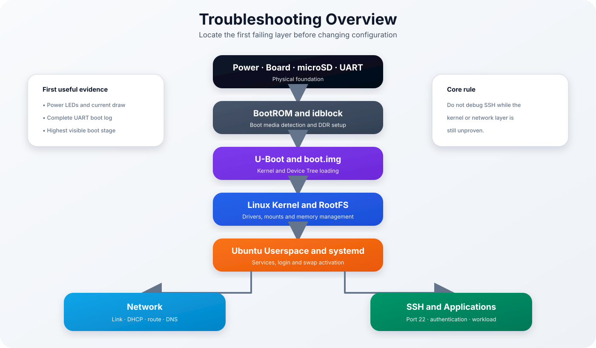

</p>

> [!NOTE]
> This guide consolidates the former troubleshooting Parts 1–3 into one engineering handbook. It follows a layered diagnostic method: identify the highest working layer, preserve evidence, apply one controlled change and verify the complete system afterward.

| Previous | Home | Next |
|-----------|------|------|
| [← Memory Optimization](memory-optimization.md) | [README](../README.md) | Development → |

---

## Table of Contents

- [Diagnostic Philosophy](#diagnostic-philosophy)
- [Diagnostic Workflow](#diagnostic-workflow)
- [Failure Layers](#failure-layers)
- [Boot Problems](#boot-problems)
- [UART Diagnostics](#uart-diagnostics)
- [Flash Recovery](#flash-recovery)
- [Kernel Panic Diagnosis](#kernel-panic-diagnosis)
- [RootFS Recovery](#rootfs-recovery)
- [systemd Diagnostics](#systemd-diagnostics)
- [Memory and OOM Diagnostics](#memory-and-oom-diagnostics)
- [Network Diagnostics](#network-diagnostics)
- [SSH Troubleshooting](#ssh-troubleshooting)
- [microSD Card Diagnostics](#microsd-card-diagnostics)
- [Build Diagnostics](#build-diagnostics)
- [Performance Diagnostics](#performance-diagnostics)
- [Controlled Maintenance](#controlled-maintenance)
- [GitHub Issue Workflow](#github-issue-workflow)
- [Troubleshooting Matrix](#troubleshooting-matrix)
- [Diagnostic Command Reference](#diagnostic-command-reference)
- [Recovery Checklist](#recovery-checklist)
- [Quick Reference](#quick-reference)

---

## Diagnostic Philosophy

<p align="center">
  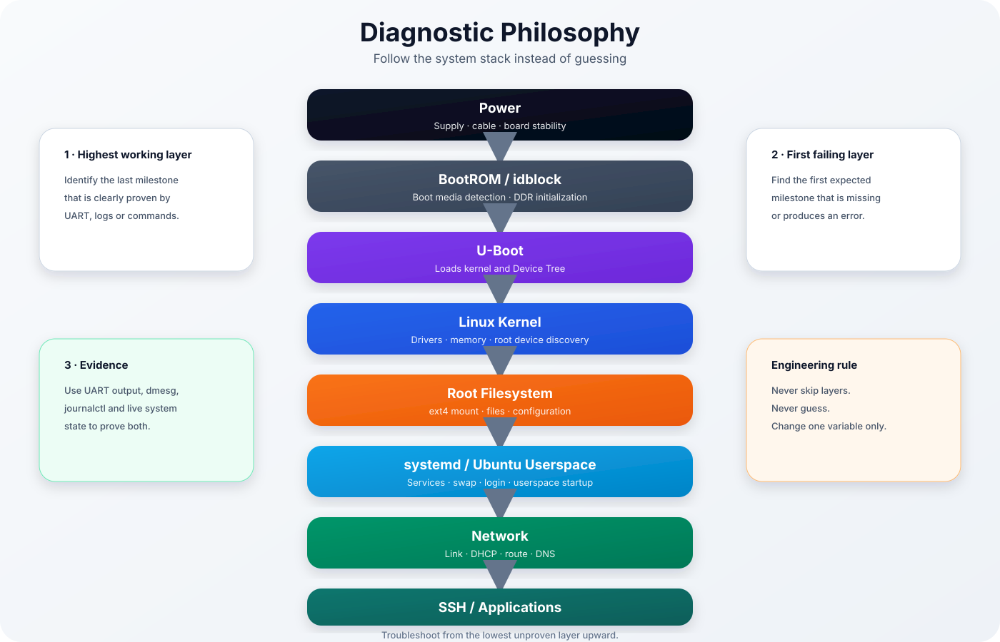
</p>

Always identify:

1. the highest layer that still works,
2. the first layer that fails,
3. the evidence that proves both conclusions.

> [!IMPORTANT]
> Troubleshoot from the lowest unproven layer upward. Never skip layers, never guess, and change only one variable at a time.

---

## Diagnostic Workflow

<p align="center">
  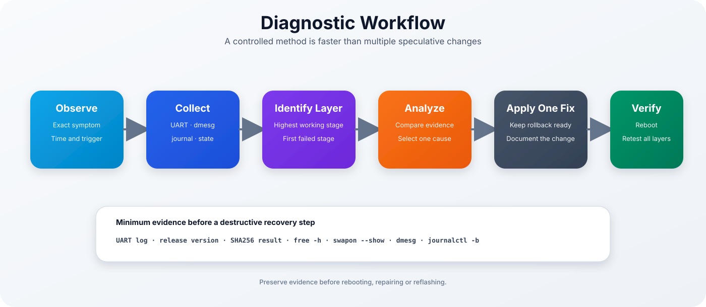
</p>

The recommended process is:

1. Observe the exact symptom.
2. Collect UART, kernel and service evidence.
3. Identify the first failed layer.
4. Select one plausible cause.
5. Apply one controlled fix.
6. Reboot and verify every dependent layer.
7. Document the root cause and result.

Minimum evidence before a destructive recovery step:

```bash
uname -a
cat /etc/os-release
free -h
swapon --show
ip address
ip route
lsblk -f
df -h
sudo systemctl --failed
sudo journalctl -b --no-pager
dmesg
```

---

## Failure Layers

| Symptom | Highest proven layer | Likely failing layer |
|---------|----------------------|----------------------|
| No LEDs or current draw | None | Power or hardware |
| LEDs but no UART output | Hardware partially proven | UART, BootROM or boot media |
| U-Boot banner visible | BootROM and bootloader entry proven | Boot image or environment |
| `Starting kernel ...` visible | U-Boot proven | Kernel, Device Tree or RootFS |
| Ubuntu login prompt visible | Kernel, RootFS and systemd proven | Network, SSH or account |
| Ping works but port 22 is closed | Network proven | SSH service |
| Password accepted, session closes | SSH authentication partially proven | PAM, shell or OOM |
| Filesystem becomes read-only | Kernel and storage detection proven | Filesystem or microSD media |

---

## Boot Problems

<p align="center">
  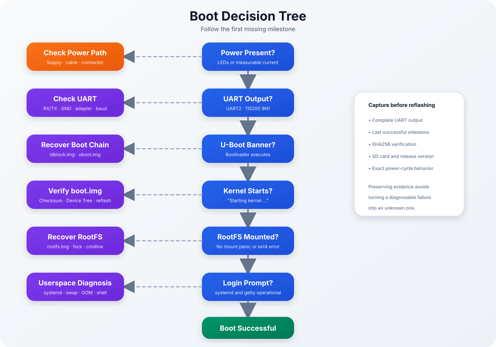
</p>

Typical symptoms:

- no LEDs,
- no serial output,
- board stops in U-Boot,
- board stops after `Starting kernel ...`,
- kernel panic,
- no login prompt,
- repeated reboot loop.

### Initial checks

- verify the USB-C power supply and cable,
- insert the correct microSD card,
- open UART before applying power,
- use UART2 at `115200 8N1`,
- verify the release checksums,
- retain the complete boot log.

### Expected milestones

```text
U-Boot 2017...
Starting kernel ...
Ubuntu 22.04 LTS luckfox ttyFIQ0
luckfox login:
```

The first missing milestone indicates the diagnostic layer.

---

## UART Diagnostics

UART is the primary recovery and diagnostic interface.

Use:

```text
Baud rate: 115200
Data bits: 8
Parity: None
Stop bits: 1
Flow control: None
```

Recommended wiring:

| USB-to-TTL adapter | Luckfox Pico Plus |
|--------------------|-------------------|
| `GND` | `GND` |
| `RXD` | `UART2_TX` |
| `TXD` | `UART2_RX` |

> [!WARNING]
> Use 3.3 V TTL logic. Do not connect the adapter power output to the board.

If no output appears:

- verify RX and TX are crossed,
- verify common ground,
- confirm the correct UART,
- try another adapter and USB port,
- open the terminal before power-on,
- test the adapter loopback separately.

---

## Flash Recovery

<p align="center">
  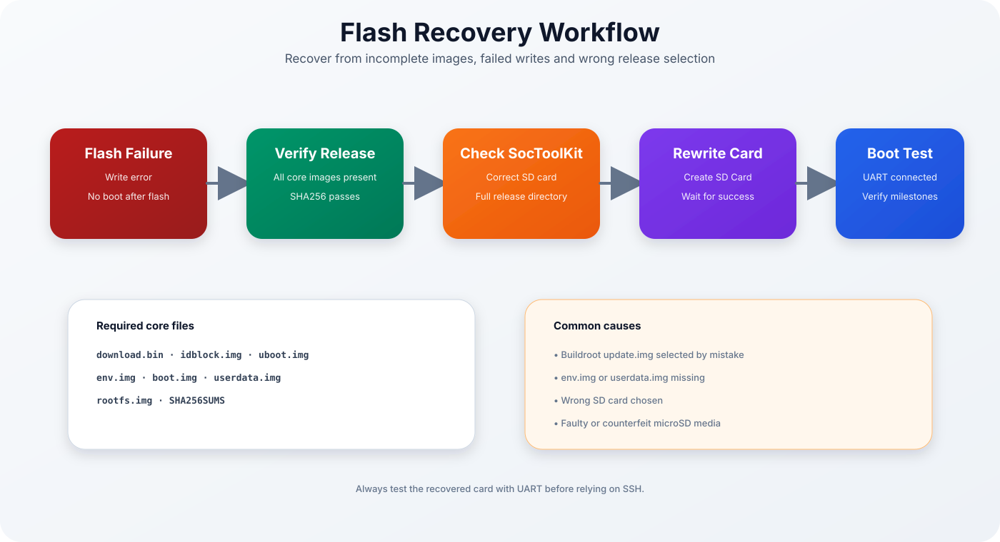
</p>

Common causes:

- wrong release directory selected,
- Buildroot `update.img` used by mistake,
- missing `env.img` or `userdata.img`,
- incomplete SocToolKit write,
- wrong target SD card,
- damaged or counterfeit microSD card.

### Verify the release

```bash
cd output/release
sha256sum -c SHA256SUMS
```

Required core files:

```text
download.bin
idblock.img
uboot.img
env.img
boot.img
userdata.img
rootfs.img
SHA256SUMS
```

Recovery sequence:

1. verify all release files,
2. verify SHA-256 checksums,
3. select the complete `output/release/` directory,
4. recreate the SD card,
5. boot with UART connected,
6. confirm each milestone.

---

## Kernel Panic Diagnosis

<p align="center">
  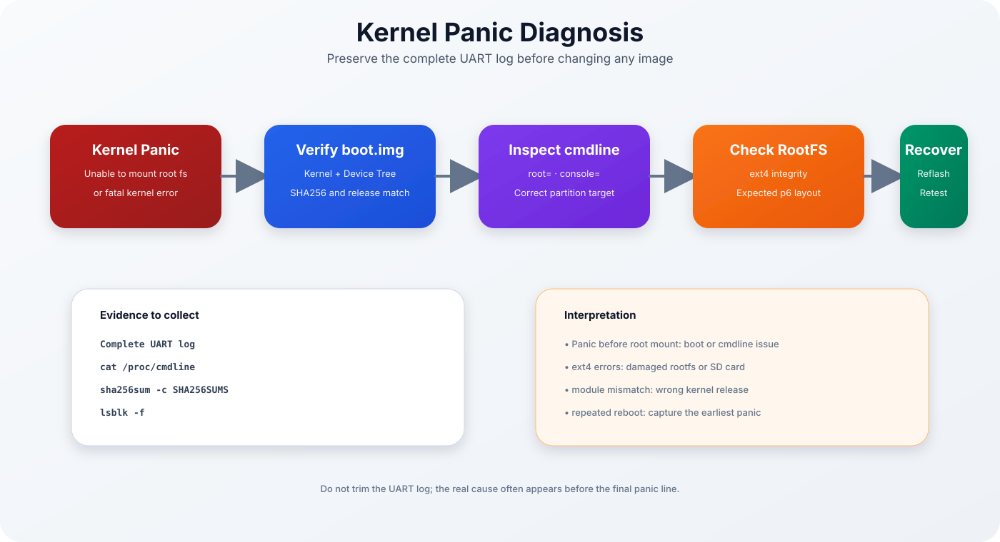
</p>

Typical panic messages:

```text
Kernel panic - not syncing
Unable to mount root fs
VFS: Cannot open root device
```

Potential causes:

- wrong or damaged `boot.img`,
- Device Tree mismatch,
- wrong `root=` kernel parameter,
- damaged RootFS,
- kernel and module mismatch.

### Useful evidence

```bash
cat /proc/cmdline
uname -a
lsblk -f
findmnt /
dmesg | tail -n 150
```

When diagnosing from the build host:

```bash
cd output/release
sha256sum -c SHA256SUMS
```

> [!TIP]
> The actual cause often appears several lines before the final panic message. Preserve the complete UART output.

---

## RootFS Recovery

<p align="center">
  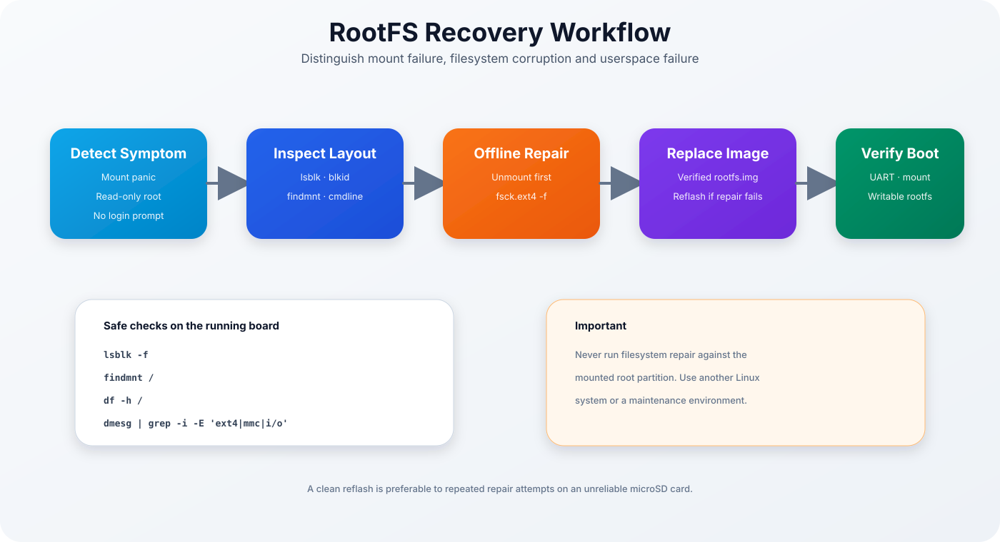
</p>

Symptoms:

- root mount panic,
- ext4 journal errors,
- read-only root filesystem,
- systemd cannot start required services,
- login prompt never appears.

### Running-system checks

```bash
lsblk -f
findmnt /
df -h /
findmnt -no SOURCE,OPTIONS /
dmesg | grep -i -E 'ext4|mmc|i/o|read-only'
```

### Offline filesystem check

Do not run filesystem repair against the mounted root filesystem.

From another Linux system:

```bash
sudo fsck.ext4 -f /dev/<rootfs-partition>
```

If errors return after a clean repair and reflash, replace the microSD card.

### Root filesystem expansion

```bash
sudo resize2fs /dev/mmcblk1p6
df -h /
```

Confirm the device before running the command:

```bash
findmnt /
```

---

## systemd Diagnostics

<p align="center">
  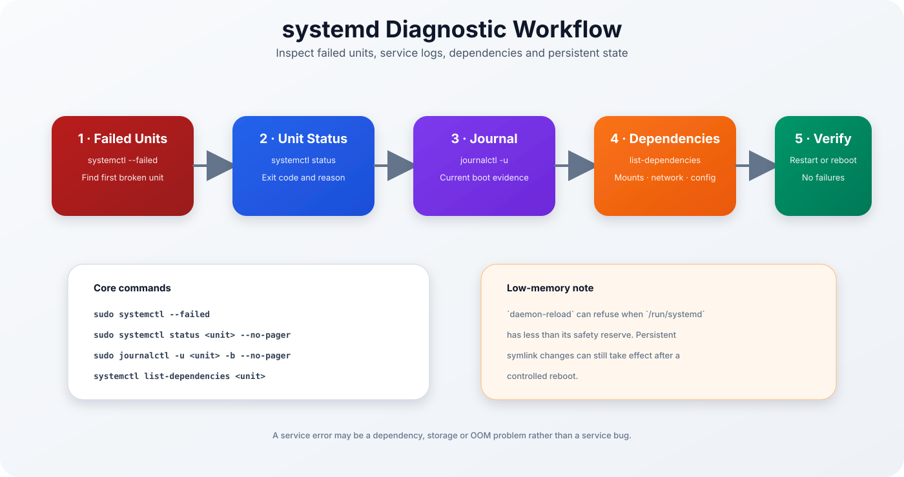
</p>

### Failed units

```bash
sudo systemctl --failed
```

### Service status

```bash
sudo systemctl status <unit> --no-pager
```

### Current-boot logs

```bash
sudo journalctl -u <unit> -b --no-pager
sudo journalctl -b --no-pager
```

### Dependencies

```bash
systemctl list-dependencies <unit>
```

### Timers and enabled services

```bash
sudo systemctl list-timers --all
sudo systemctl list-unit-files --state=enabled
```

A failed service can be a consequence of:

- missing storage,
- unavailable networking,
- invalid configuration,
- insufficient memory,
- failed dependency,
- incorrect permissions.

### `/run/systemd` safety warning

On this low-memory system, systemd can report:

```text
Refusing to reload, not enough space available on /run/systemd.
```

Persistent unit symlink changes may still exist. Verify them and perform a controlled reboot.

---

## Memory and OOM Diagnostics

<p align="center">
  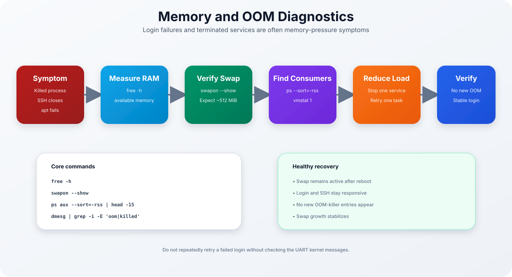
</p>

Real OOM symptom observed during development:

```text
Out of memory: Killed process 306 (login)
```

### Core checks

```bash
free -h
swapon --show
ps aux --sort=-rss | head -15
vmstat 1
dmesg | grep -i -E 'oom|out of memory|killed process'
```

Expected swap size:

```text
approximately 512 MiB
```

If swap is missing:

```bash
grep '^/swapfile ' /etc/fstab
ls -lh /swapfile
sudo swapon /swapfile
swapon --show
```

Common triggers:

- login before swap activation,
- `apt` or `dpkg`,
- large Python imports,
- several simultaneous services,
- automated maintenance jobs,
- memory leak,
- repeated SSH sessions.

Recovery:

1. preserve the OOM log,
2. verify swap,
3. identify the largest RSS consumers,
4. stop one nonessential service,
5. retry one workload,
6. confirm that no new OOM event occurs.

---

## Network Diagnostics

<p align="center">
  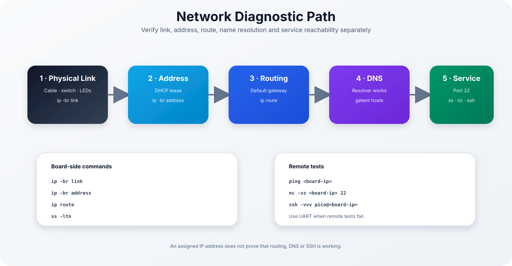
</p>

Troubleshoot separately:

1. physical link,
2. IP address,
3. default route,
4. DNS,
5. target service.

### Board-side commands

```bash
ip -br link
ip -br address
ip route
getent hosts archive.ubuntu.com
ss -ltn
```

### Connectivity tests

```bash
ping -c 4 <gateway-ip>
ping -c 4 8.8.8.8
getent hosts github.com
```

Interpretation:

| Result | Meaning |
|--------|---------|
| Interface down | link, cable, switch or driver |
| Link up, no address | DHCP or interface configuration |
| Address present, no default route | routing issue |
| Gateway reachable, DNS fails | resolver issue |
| Ping works, port 22 closed | SSH daemon not listening |

---

## SSH Troubleshooting

<p align="center">
  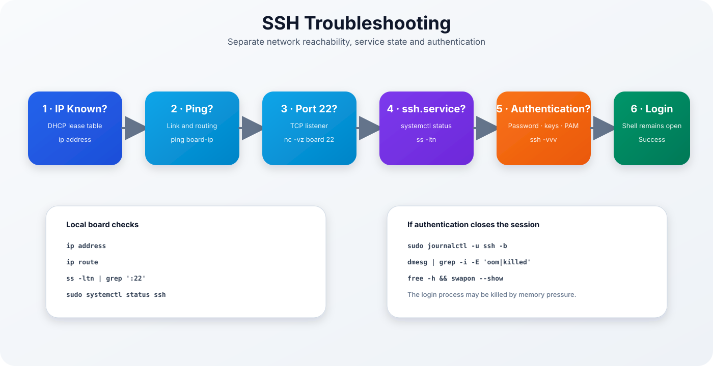
</p>

### Remote tests

```bash
ping <board-ip>
nc -vz <board-ip> 22
ssh -vvv pico@<board-ip>
```

### Local board checks

```bash
ss -ltn | grep ':22'
sudo systemctl status ssh --no-pager
sudo journalctl -u ssh -b --no-pager
```

Common cases:

| Symptom | Likely cause |
|---------|--------------|
| Timeout | link, IP or route |
| Connection refused | SSH service not listening |
| Permission denied | password, key or account |
| Password accepted, connection closes | PAM, shell or OOM |
| Intermittent disconnects | memory or storage pressure |

If the session closes after authentication:

```bash
free -h
swapon --show
dmesg | grep -i -E 'oom|killed process'
```

---

## microSD Card Diagnostics

<p align="center">
  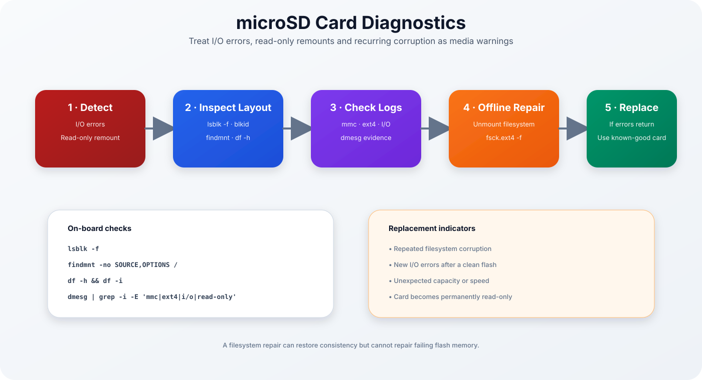
</p>

### Inspect layout and mounts

```bash
lsblk -f
blkid
findmnt
df -h
df -i
```

### Search for storage errors

```bash
dmesg | grep -i -E 'mmc|ext4|i/o error|read-only|buffer'
```

Replacement indicators:

- repeated filesystem corruption,
- new I/O errors after a clean flash,
- unexpected capacity,
- poor or unstable write speed,
- permanent read-only state.

> [!IMPORTANT]
> `fsck` can repair filesystem metadata. It cannot repair failing flash memory.

---

## Build Diagnostics

<p align="center">
  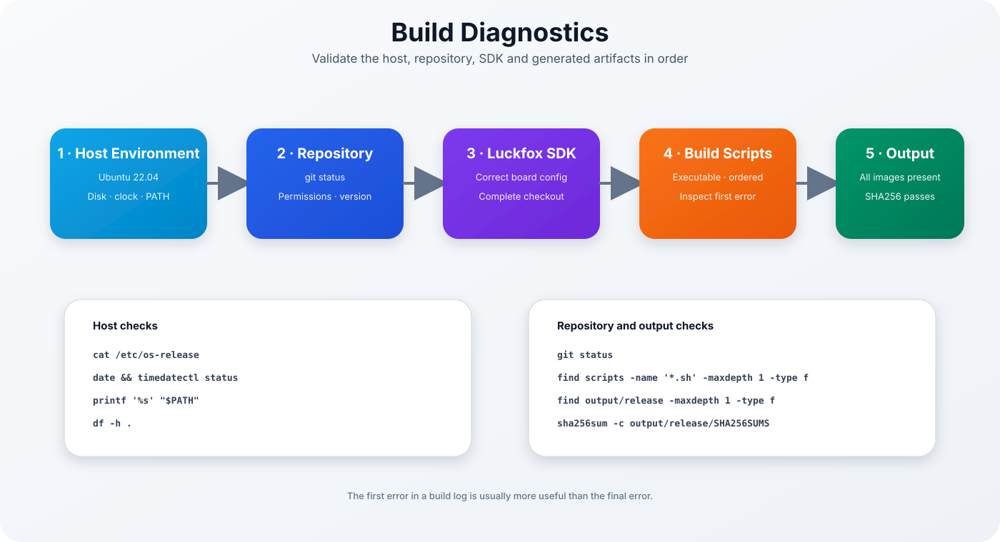
</p>

### Host checks

```bash
cat /etc/os-release
date
timedatectl status
printf '%s\n' "$PATH"
df -h .
```

### Repository checks

```bash
git status
git log --oneline --decorate -5
git submodule status
```

### Script permissions

```bash
find scripts -maxdepth 1 -type f -name '*.sh' -printf '%M %p\n'
chmod +x scripts/*.sh
```

### Release checks

```bash
find output/release -maxdepth 1 -type f -printf '%f\n' | sort
cd output/release
sha256sum -c SHA256SUMS
```

Common build causes:

- Windows directories in WSL `PATH`,
- incorrect WSL clock,
- incomplete SDK checkout,
- wrong board configuration,
- missing executable bit,
- insufficient disk space,
- missing intermediate image,
- stale or partially patched source tree.

> [!TIP]
> Diagnose the first error in the build log. Later errors are often cascading consequences.

---

## Performance Diagnostics

Performance problems on this board are frequently memory or storage problems.

```bash
uptime
top
free -h
swapon --show
vmstat 1
ps aux --sort=-rss | head -20
```

Important `vmstat` columns:

| Column | Meaning |
|--------|---------|
| `r` | Runnable processes |
| `b` | Tasks blocked on I/O |
| `si` | Swap read into RAM |
| `so` | RAM written to swap |
| `wa` | CPU time waiting for I/O |

Signs of an unsuitable workload:

- continuous swap-in and swap-out,
- steadily increasing swap usage,
- high I/O wait,
- unresponsive SSH,
- repeated OOM events,
- essential services failing during application startup.

---

## Controlled Maintenance

<p align="center">
  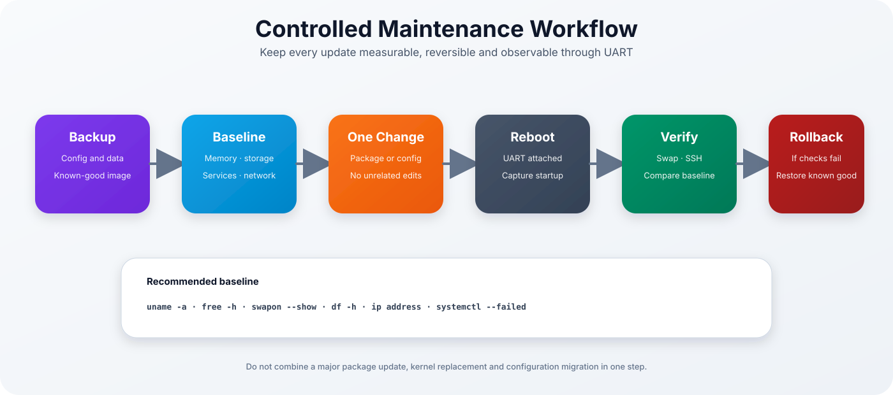
</p>

Recommended sequence:

1. back up configuration and data,
2. record a baseline,
3. apply one logical change,
4. reboot with UART attached,
5. repeat the baseline checks,
6. roll back if essential behavior changes.

Baseline:

```bash
uname -a
free -h
swapon --show
df -h
ip address
sudo systemctl --failed
ps aux --sort=-rss | head -15
```

Avoid combining:

- major package update,
- kernel replacement,
- filesystem migration,
- service reconfiguration,

in one maintenance step.

---

## GitHub Issue Workflow

<p align="center">
  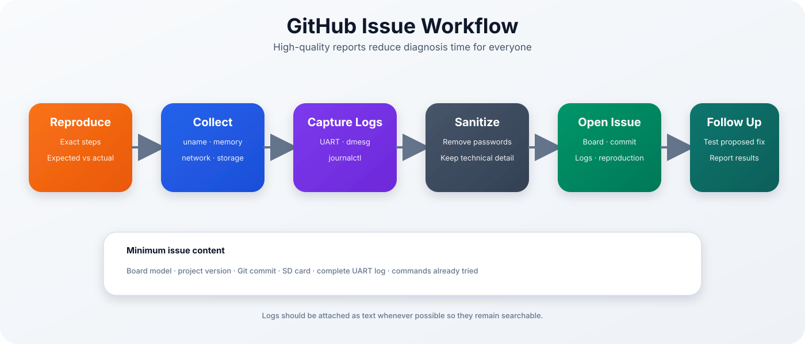
</p>

A useful issue includes:

- exact board model,
- project version,
- Git commit,
- build-host information,
- microSD brand and capacity,
- exact reproduction steps,
- expected and actual results,
- complete UART log,
- diagnostic command output,
- changes made after flashing.

Suggested format:

```markdown
## Environment

- Board:
- Project version:
- Git commit:
- Build host:
- SD card:

## Problem

Describe the exact symptom.

## Steps to Reproduce

1.
2.
3.

## Expected Result

...

## Actual Result

...

## Logs

Attach UART, dmesg, journal and diagnostic output.
```

Review logs before sharing and remove:

- passwords,
- private keys,
- tokens,
- sensitive internal addresses,
- confidential hostnames.

---

## Troubleshooting Matrix

| Symptom | Likely layer | First action |
|---------|--------------|--------------|
| No LEDs | Power | Verify supply and cable |
| No UART | Hardware / BootROM | Verify UART2 wiring |
| U-Boot only | Boot image | Verify `boot.img` |
| Kernel panic | Kernel / RootFS | Capture panic and inspect `root=` |
| No login prompt | RootFS / systemd / OOM | Check UART and swap |
| SSH timeout | Network | Verify IP and route |
| SSH refused | SSH daemon | Check port 22 and service |
| SSH closes after password | PAM / shell / OOM | Check journal and OOM log |
| Root filesystem read-only | Filesystem / SD card | Preserve logs and inspect ext4 |
| `apt` killed | Memory | Verify swap and stop services |
| Missing release image | Build pipeline | Inspect first failed build stage |
| Repeated corruption | microSD media | Replace card |

---

## Diagnostic Command Reference

### System identity

```bash
uname -a
cat /etc/os-release
cat /proc/version
cat /proc/cmdline
```

### Memory

```bash
free -h
swapon --show
cat /proc/meminfo
vmstat 1
ps aux --sort=-rss | head -20
```

### Services

```bash
sudo systemctl --failed
sudo systemctl status <unit> --no-pager
sudo journalctl -u <unit> -b --no-pager
sudo journalctl -b --no-pager
```

### Network

```bash
ip -br link
ip -br address
ip route
ss -ltn
getent hosts <hostname>
```

### Storage

```bash
lsblk -f
blkid
findmnt
df -h
df -i
```

### Kernel evidence

```bash
dmesg
dmesg | grep -i -E 'error|fail|warn|oom|killed|ext4|mmc|i/o'
```

### Build and release

```bash
git status
git log --oneline -5
find output/release -maxdepth 1 -type f
sha256sum -c output/release/SHA256SUMS
```

---

## Recovery Checklist

Before declaring recovery successful:

- [ ] Complete UART boot has no unexplained fatal errors
- [ ] Ubuntu login prompt appears
- [ ] Ubuntu 22.04 and Linux 5.10.160 are confirmed
- [ ] Swap is active
- [ ] No new OOM events are present
- [ ] No unexpected failed systemd units remain
- [ ] Root filesystem is writable
- [ ] No new ext4 or MMC errors appear
- [ ] DHCP address and default route are present
- [ ] SSH login remains stable
- [ ] A clean reboot has been tested
- [ ] Root cause and corrective action are documented

---

## Quick Reference

<p align="center">
  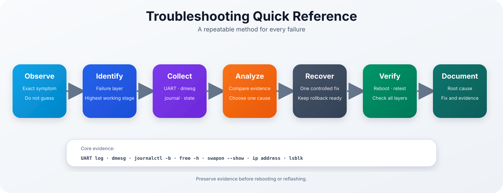
</p>

---

## Engineering Rules

1. Preserve evidence before rebooting or reflashing.
2. Diagnose from the lowest unproven layer upward.
3. Change one variable at a time.
4. Verify every release before flashing.
5. Keep UART connected during recovery.
6. Treat repeated storage errors as a media problem.
7. Confirm swap before troubleshooting login instability.
8. Validate every fix after a clean reboot.
9. Keep known-good release artifacts and a spare SD card.
10. Document successful recoveries for future reference.

---

## Continue Reading

| Previous | Home | Next |
|-----------|------|------|
| [← Memory Optimization](memory-optimization.md) | [README](../README.md) | Development → |
